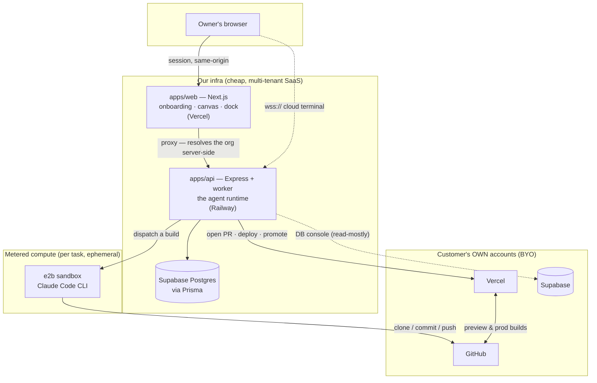

# Lu Computer — Build Map & Status

> The one place that answers **"where are we, and what's left?"** Grounded in the actual code
> (re-verified 2026-07-16). Companion to the spec — [FOUNDATION.md](./FOUNDATION.md) = *what it is*,
> [ROADMAP.md](./ROADMAP.md) = *the order/themes*, [MANIFESTO.md](./MANIFESTO.md) = *why*. Deep dives:
> [docs/building-agents.md](./docs/building-agents.md) (how agents are built) ·
> [docs/canvas.md](./docs/canvas.md) (the surface) · [docs/agent-backend.md](./docs/agent-backend.md) (reference).
> **This is a living checklist: check the boxes as we ship.**

Legend: **✅ built & working** · **🟡 built but partial/fragile** · **⬜ not built yet**

---

## 1. The system at a glance



## 2. "Build me a website" — the end-to-end flow

```mermaid
sequenceDiagram
  actor You
  participant Lu as Lu · orchestrator (Sonnet)
  participant Eng as Engineer (Opus)
  participant Box as e2b sandbox
  participant GH as GitHub
  participant VC as Vercel

  You->>Lu: "build me a website"
  Lu->>Lu: create_task + dispatch_to_engineering
  Note over Lu,Eng: agent→agent · GATE: GitHub + Vercel must be connected
  Lu->>Eng: run build (via worker)
  Eng->>GH: create_site — repo from starter template
  Eng->>Box: run_coding_agent — Claude Code writes the site
  Box->>GH: commit + push branch
  Eng->>GH: open PR
  Eng->>VC: create project + preview deploy
  Eng-->>You: task → needs_approval (preview link + PR diff)
  You->>Eng: Publish ✅ (approval)
  Eng->>GH: merge PR
  Eng->>VC: promote to production
  Note over You,VC: site is live
```

---

## 3. The build tracker

### Runtime & orchestration
- [x] **Lu orchestrator** — real Sonnet tool-loop; persists the thread; tools: `create_task`, `dispatch_to_engineering`, `check_connections`, `ask_user`. `apps/api/src/agent/orchestrator.ts`
- [x] **Agent→agent dispatch** — Lu dispatches the Engineer *inside the runtime* (the old hard-coded web hand-off is gone). `agent/dispatch.ts`, `agent/orchestratorTools.ts`
- [x] **Planning — the plan gate** *(built 2026-07-17)* — Lu now **plans first**: `propose_plan` drafts a plan (a `doc` artifact — objective · steps · acceptance) and stages an **`approve_plan`** gate *instead of* building; the plan renders as a review card in the chat (`LuBuildTracker` + `PlanApprovalCard`), and **approving it dispatches the Engineer using the plan as its brief** (`routes/approvals.ts` branches the resolve on the action). The **actionable roadmap** ships too — every dock "next" (Connect GitHub, etc.) fires a Lu intent, not a dead link (`DockHome`/`dock-data`). Spec: [docs/planning.md](./docs/planning.md). Approve / **Request changes** (Lu re-plans with the owner's feedback) / Reject are all wired. 🟡 Remaining: only the cosmetic enum precision (a first-class `planned` status / `Task.acceptance` column — functionally covered by `agent_can_do` + the plan doc, no gap).
- [x] **Acceptance verification** *(built 2026-07-17)* — after `open_preview` the Engineer runs **`verify_acceptance`**: an LLM judge scores the build against the plan's acceptance criteria; on `unmet` it **reworks** (`run_coding_agent` again) and re-verifies, and it will **not `request_publish` until acceptance passes** (`engineeringTools.ts` + `engineering.ts`). 🟡 Deeper (broader agent-workflow): a first-class `needs_rework` status + a tests-in-CI gate.
- [x] **Store port** — Prisma (prod) + in-memory (test); Tasks/Sites/Approvals/Deployments/Connections fully implemented.
- [x] **Model gateway + tiering** — multi-provider, per-role model (orchestrator→Sonnet, coding→Opus, routine→Haiku) + a dock model picker. `packages/core/src/models.ts`
- [x] **Usage metering + working/core memory + sleep-time consolidation** — shipped *(per the AI-plan doc; reconcile there)*.
- [ ] 🟡 **Durable worker** — the BullMQ worker is **built but INACTIVE**: `REDIS_URL` is unset, so builds run **in-process fire-and-forget** (a crash/redeploy mid-build loses the run and can wedge a task at `in_progress`). Setting `REDIS_URL` activates it. `worker.ts`, `queue.ts`, `dispatch.ts`
- [ ] ⬜ **Spawn/supervise sub-agents** — `Task.parentTaskId` exists; a `spawn_agent` tool + supervision loop is not built.
- [ ] ⬜ **xAI / Grok** in the gateway.

### The Engineer — the build pipeline
- [x] **create_site** — creates a real private GitHub repo from a template + a `Site` row; idempotent.
- [x] **run_coding_agent** — boots a **real e2b sandbox**, runs the **Claude Code CLI headless**, commits + pushes `lu/build`, saves the full transcript as an `agent_session` artifact.
- [x] **open_preview** — real PR + Vercel project + preview deploy; records `pr_diff` + `site_preview` artifacts; flips the task to `needs_approval`.
- [x] **request_publish → confirmPublish** — real human-in-the-loop gate; owner-approved merge + promote-to-prod (a server action, not a model tool).
- [x] **Cloud terminal** — `wss /api/terminal` ↔ e2b pty ↔ xterm.js node on the canvas.
- [ ] 🟡 **generate_image** — `gpt-image-1` is real; **Flux / Higgsfield are placeholders**.
- [ ] 🟡 **Reliability gaps** (fine for dogfooding, break a real BYO user): hardcoded **private** template `glevi2004/lu-site-starter`; `{slug}.lu.computer` domain assumed on the customer's Vercel; preview poll ≈24s (shorter than a real build); no post-build reconciliation.

### BYO connect — GitHub · Vercel · Supabase
- [x] **Token-paste + verify + encrypted storage** — all three providers; verified against the provider API; AES-256-GCM at rest. `routes/connect.ts`, `crypto/tokens.ts`
- [x] **Org-scoped git/deploy ports** — per-org token with env fallback (the dogfood path).
- [x] **Dispatch gate** — the Engineer is only dispatchable once **GitHub + Vercel** are connected (`connect/status.ts`).
- [ ] 🟡 **GitHub for *any* user** — works via a pasted PAT, but blocked by the private template, the `GITHUB_OWNER` env owner-override (repos land in the platform's org), and the raw PAT sprayed into the sandbox.
- [ ] 🟡 **Vercel for *any* user** — works via a pasted token, but blocked by the `lu.computer` domain assumption + the undocumented manual **Vercel↔GitHub app install**.
- [ ] 🟡 **Supabase** — **console-view only** (the UI even drops the management token); the service key never reaches the build, so "the Engineer builds into your Supabase" is not yet code. Only needed for apps with a backend, not a basic website.
- [ ] ⬜ **Real OAuth** — no GitHub-App install / Vercel Integration / Supabase OAuth anywhere; token-paste only. (Target design: [docs/byo-connect.md](./docs/byo-connect.md).)
- [ ] ⬜ **Storage correctness** — no `@@unique([orgId])` on the connection tables → non-atomic `findFirst→create` upsert → duplicate/stale tokens under concurrency.
- [ ] ⬜ **Token expiry / refresh / rotation** — none.

### Owner visibility — "watch Lu build"
- [x] **Live task tracker** — real `Task` rows polled every 3s across **5 surfaces**: Lu chat, dock Home, dock Tasks, canvas (agent spinner/badge), department page.
- [x] **Live site previews** — real deploy iframes on the canvas + department page ("Building…" until a URL exists).
- [x] **Publish gate UI** — real Publish/Reject → merge + promote.
- [ ] 🟡 **Depth in the chat** — where you *ask*, you get task rows + a spinner: no subtask breakdown, no build logs, no PR diff. The rich detail (transcript, diff) exists but is **buried** in the canvas → Engineering agent panel.
- [ ] 🟡 **Persistence of the watch** — the in-chat build tracker lives in React state → a page reload empties it (the tasks survive server-side).
- [ ] 🟡 **`/home` is stale** — the default landing surface is a one-shot server render, not live.
- [ ] ⬜ **Chat → deeper-view links** after "dispatched the Engineer"; ⬜ **Revert All / Request-changes** (currently toast stubs).

### Canvas & dock
- [x] **Canvas** — pan/zoom plane; Lu + department pills + resource nodes (terminal/note/file/folder/site); edges-as-grants; Engineering depth-cards.
- [x] **Canvas persistence** — CanvasNode/Edge routes + web client (positions/nodes persist to the DB) *(per earlier audit; reconcile)*.
- [x] **Cofounder dock** — Home / Lu / Company / Tasks / Library tabs.
- [x] **Frame sizing + re-space pass** — nodes enlarged to ~75% of the dept cards, tighter corners *(this session)*.

### Onboarding
- [x] **Waitlist-gated self-serve** — real Supabase org; `completeOnboarding` writes config + provisions the Engineering department.
- [x] **Real-data only** — the Mature/New demo-profile / injected-org system is fully removed *(this session)*.
- [ ] ⬜ **Connect step at build-time** — nothing enforces or explains GitHub+Vercel at the moment a build needs them.
- [ ] 🟡 **Scrape + interview depth** *(reconcile with [docs/onboarding.md](./docs/onboarding.md))*.

### Platform / infra / security  *(gates external users)*
- [ ] ⬜ **API auth** — `apps/api` trusts a **client-supplied `orgId`** with no shared secret → any caller can act as any org (cross-tenant). **Hard blocker before real customers.**
- [ ] 🟡 **Terminal secret exposure** — the cloud terminal seeds the platform's GitHub/Anthropic keys into a user-reachable shell *(security review)*.
- [ ] ⬜ **Supabase RLS in migrations** — RLS exists only as hand-applied prod state, not reproducible from the repo.

### The company — the other departments
- [x] **Engineering** — the flagship, operational.
- [ ] ⬜ **Support · Finance · Sales · Marketing · Design · Operations · Legal** — prompt-forbidden + unprovisioned (each follows the Engineer's pattern).

### Channels
- [ ] ⬜ **Phone (SMS/voice) · Email inbox · Slack** — none built.

### Debt & cleanup
- [x] **Demo/mock removal** *(this session)*.
- [ ] 🟡 **Sarah→Lu rename** (~59 refs) + `@leadanswered/*` package names + `leadanswered.com` in env/cookies + the `/sarah` route.
- [ ] 🟡 **Landing-page** still carries old-product positioning (rewrite pass).

---

## 4. The critical path — "any owner builds a website, reliably"

The shortest ordered path from "works when I dogfood it" to "a design partner can use it":

1. ⬜ **Auth on `apps/api`** (shared proxy→api secret, then signed per-request org) — unblocks safe external use; prerequisite for everything below.
2. 🟡 **Public/Lu-owned starter template** + drop the `GITHUB_OWNER` override — GitHub works for any user's own account.
3. 🟡 **Real domain** — the owner's domain, or a `*.lu.computer` wildcard on **our** Vercel (not theirs) — plus surface the Vercel↔GitHub install — so deploys actually publish.
4. 🟡 **Activate the durable worker** (`REDIS_URL`) — builds survive crashes/redeploys.
5. 🟡 **Widen the preview poll + add reconciliation** — previews reliably appear instead of empty-on-first-pass.

After that it's a real product. **Depth-in-chat** (logs/subtasks in the conversation) and **one-click OAuth connect** are polish that make it *sing*, not gates.

---

## 5. The milestone: Lu builds Lu (dogfood)

Hand Lu a task → a fleet of coding agents build it **durably** → it **ships to real infra** → we use Lu to build the rest of Lu (the other departments, channels, presets). The pipeline above already runs end-to-end with the platform's own creds — so the milestone is gated mainly by **durability (worker)** + **reliability (items 2–5)**, not by unbuilt machinery.
