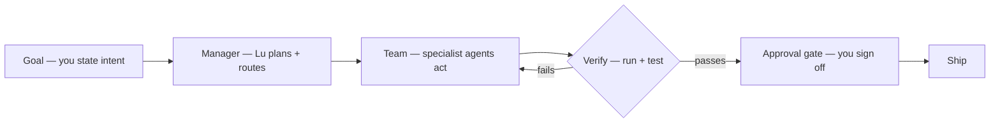
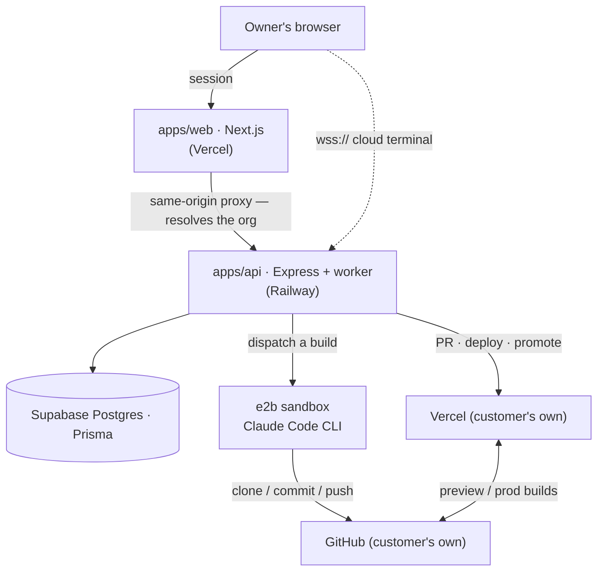
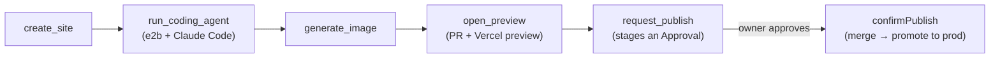
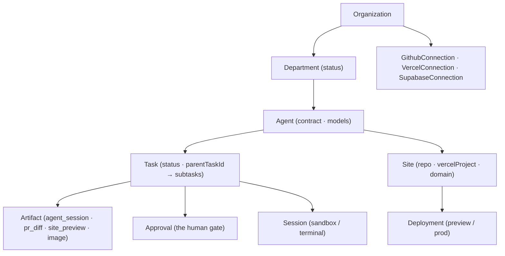

# Lu Computer — Foundation

The system spec of record: how Lu is built. If a decision about the build lives anywhere, it lives here.
(Theory: [paper.md](./paper.md) — the target architecture this realizes · Why: [MANIFESTO.md](./MANIFESTO.md) ·
Implementation plan: [docs/harness-spec.md](./docs/harness-spec.md) — paper → substrates, with live checkboxes ·
Status: [DEVELOPMENT.md](./DEVELOPMENT.md) · Money: [BUSINESS.md](./BUSINESS.md) · Next:
[ROADMAP.md](./ROADMAP.md) · Deep specs: [`docs/`](./docs/), esp. [building-agents](./docs/building-agents.md)
(how we build agents) + [canvas](./docs/canvas.md) (the surface).)

## Why now — the technical bet

Code was the **first knowledge work AI mastered**, for three structural reasons: it's **verifiable** (it
compiles or it doesn't; the test passes or it doesn't — a ground-truth signal to train against *and* to
trust), **abundant** (every commit that fixed a bug is labelled training data), and **fast to iterate**
(write → run → error → fix in seconds, no human in the loop). That's why agentic coding works at all.

The tools that rode that curve kept the wrong **shape** — an assistant in the editor. Autocomplete → Copilot
→ Cursor each made *you* a faster developer, but you stayed the architect, the tester, and the operator.
Typing was always the sliver; the work is the dozen disciplines around it (architecture · data · design ·
testing · deployment · secrets · monitoring — each a *process*).

The bet: the loop **closes** once you assemble the missing pieces — **a goal** (you state intent), **a
manager** (Lu decomposes → plans → routes), **a team** (specialist agents with real ports to *act*), and
**verification** (the agent runs and tests its own output). The same verifiability that made code fall to AI
is what lets the system check its own work end to end — so it can **build → test → ship**, not just type,
with the human only at the approval gate.

This is why "the computer is the developer" **begins in Engineering** — the one function whose loop can
actually close — and dogfoods outward. The full argument — why the harness must be cloud-native, stateful,
multi-model, and empirically verified, and why it composes substrates instead of reimplementing them — is
the paper ([paper.md](./paper.md)); everything below is how that architecture is built as a product.

## 1. The shape

Lu Computer is a workspace for AI agents. Its parts:

- **Screen** — the canvas: a pannable plane with Lu at the center and agents around it. This is home.
- **Shell** — a cloud terminal you can open (a real machine, via e2b).
- **Files** — the Library (artifacts agents produce) + the Context (what agents know about you).
- **Programs** — the agents.
- **Channels** — how you and the agents reach the world: a **phone** (SMS/voice), an **email** inbox, and
  **Slack**.
- **Presets** — boot the workspace for a use: **Business**, **Studio/Dev**, **Personal**, **Custom**.
- **Approvals** — you sign off on anything irreversible.

Live today: the screen, shell, agents, and approvals. On the roadmap: phone, email, Slack, and the presets
beyond Business. The owner boots their company in onboarding, then works on the **canvas** — one graph of
**Lu + departments** (each an agent's own **app**: Home / database console / workplace) **+ resources**
(terminal · note · file · folder · site) joined by **edges-as-grants** — with the **Lu dock** (chat/command)
wrapped around it. The canvas is the whole product surface; its complete model is **[docs/canvas.md](./docs/canvas.md)**.

## 2. The stack

Monorepo under `platform/` (pnpm workspace):

| Package | Role | Runs on |
|---|---|---|
| `apps/web` | Next.js — onboarding, canvas, dock, department surfaces | **Vercel** (`leadanswered-web`) |
| `apps/api` + worker | Express/TS — the agent runtime, HTTP routes, the durable worker, the terminal ws | **Railway** |
| `packages/db` | Prisma 7 schema + client → **Supabase Postgres** | — |
| `packages/core` | The multi-provider model gateway | — |
| `landing-page/` | Public marketing site (Astro) | Vercel (`leadanswered`) |

- **Auth**: Supabase Auth (cookie sessions); a session maps to an `Organization` by `ownerEmail`.
- **web ↔ api**: the browser calls same-origin Next routes that proxy to `apps/api` and resolve the org
  server-side. The cloud terminal is the exception — a `wss://` straight to the api.
- This is **our own** product infra — a cheap multi-tenant SaaS. What *agents build* for a customer lives
  in the **customer's own accounts** (§7), not ours.

## 3. Orchestration

**Lu** is the top conductor: a goal → a **Plan** the owner approves (the **plan gate** —
[docs/building-agents.md §5](./docs/building-agents.md)) → **Tasks** routed to the right agent, and "done" means the plan's
**acceptance criteria are verified** (`verify_acceptance`), not that the agent stopped. Lu does not do the
work itself. *(This is the paper's Goal → Outcome → Task decomposition with its verification loop; the
deepening path — empirical checks, retry budgets — is [harness-spec §2](./docs/harness-spec.md).)*

**Orchestration is recursive and multi-model.** An agent is a program you compose on the fly: it runs
**any model** (`Agent.models`, via the gateway — Anthropic / OpenAI / Google today; **xAI/Grok** is on the
roadmap, not yet in the gateway) and can **spawn and orchestrate sub-agents** (a child `Task` via
`parentTaskId`), including attaching and driving a live **cloud terminal**'s pty. Connections are drawn on the canvas as **`Edge`s** between
**`CanvasNode`s** (the who-conducts-whom graph). Lu runs the top; every agent can run the ones beneath it.

**Departments** are the **Business preset's** unit — each department *is* its agent, rendered as its own
**app** (Home / database console / workplace); resources connect to it as its working set (the full model:
**[docs/canvas.md](./docs/canvas.md)**). v0 provisions **Engineering only**; the rest of Business, and the
other presets, are the roadmap.

## 4. The runtime

Every agent is a **`generateText` tool-loop** (Vercel AI SDK v6): a system prompt (its contract), a set of
port-backed `tool()`s, and `stopWhen`. Agents read/write only through the **`Store` port** (Prisma in
prod, in-memory in tests) — never the DB directly.

**Runs are async and durable.** Work is dispatched off the request path against a durable **Task** and run
by a background **worker** — **BullMQ + Redis**, borrowing the durability semantics of Trigger.dev /
Inngest-class engines without adopting one — so an overnight run survives a redeploy or crash. For long work the worker **supervises rather
than executes**: the marathon (a coding agent building for hours) runs *inside the e2b sandbox* while the
worker streams progress to the Store as **Artifacts**, parks on **Approvals** (hibernating the sandbox),
and resumes when resolved. Persistent state is cheap DB rows; heavy compute is ephemeral + metered.
*(The durable worker is **built** — BullMQ; it runs in-process until `REDIS_URL` activates crash-safe
durability. How it works + how to build any agent: [docs/building-agents.md](./docs/building-agents.md).)*

## 5. The Engineer (the flagship agent)

Turns "build me X" into a deployed thing. Runs **async** (`POST /api/engineering` → `202 {taskId}` →
worker) over five **ports** — the last three provision into the **customer's own accounts** (§7):

- **Sandbox** (e2b): an isolated cloud machine — clone, `exec`, stream a **pty**.
- **Git** (Octokit; PAT token-paste today, GitHub App installation tokens are the upgrade —
  [harness-spec §3](./docs/harness-spec.md)): create repo, open/merge PR, diff.
- **Deploy** (Vercel): create project, get the PR preview, promote to prod, attach a domain.
- **Data** (Supabase Management API): provision the app's project/database, run migrations.
- **Model gateway**: text (coding) + image (hero).

**Pipeline:** `create_site` → `run_coding_agent` (Claude Code / Codex writes the code in the sandbox) →
`generate_image` → `open_preview` (PR → preview) → `request_publish` (an **Approval**) → `confirmPublish`
(merge → promote). Every step emits an **Artifact** rendered live on the canvas. The **cloud terminal**
(ws `/api/terminal` ↔ e2b pty ↔ xterm.js) is the interactive door to the same runtime.

> How the Engineer is built — and the repeatable recipe for adding any agent — is the handbook:
> [docs/building-agents.md](./docs/building-agents.md).

## 6. The data model (`packages/db`)

Additive tables, scalar `orgId`, no FK to `Organization`, so they compose freely: `Department`
(`status`) · `Agent` (`contract`, `models`) · `ContractRevision` · `Task` (`status`, `parentTaskId`) ·
`Artifact` (`agent_session|pr_diff|site_preview|image|…`) · `Site` (`repoFullName`, `vercelProjectId`,
`domain`) · `Deployment` · `Session` (sandbox/terminal) · `Approval` · `CanvasNode` / `Edge` /
`Collection`. `Organization` + Supabase auth are the shared foundation; a `Waitlist` gates signup.

## 7. Where the things agents build live

Lu is a **cloud computer**, not a per-user VM. Three cost layers — and we are the **payer-of-record for
only the first two**:

- **Our product (fixed, cheap):** `apps/web` (Vercel), `apps/api` + the durable worker (Railway), the
  platform DB (Supabase). Multi-tenant SaaS; scales like any SaaS.
- **Agent compute (metered):** real machines appear only when an agent works — **ephemeral e2b
  sandboxes**, spun up per task and torn down or hibernated. This is what the usage bucket meters (the
  agent-hour). Never a 24/7 box.
- **What agents build → the customer's OWN accounts.** By default Lu sets it all up *for* the owner —
  OAuths their **GitHub + Vercel + Supabase** and provisions the repo / project / database — but it lives
  in **their** accounts and **they** pay those bills directly. Magic setup, customer-owned infra, and
  **zero hosting cost or risk to us**. Free tier = preview-only (no standing infra); real infra begins at
  paid; idle scales to zero.

**Destination (at scale):** an optional **Lu-managed + metered** hosting tier (we front the infra and bill
it through usage — the cofounder model) once metering and volume justify it. Until then it is always the
customer's infra.

**The rule:** be the payer-of-record for nothing but our own small SaaS and metered agent compute; route
everything else to the customer's accounts.

## 8. Onboarding, auth & command

- **Waitlist-gated self-serve**: join → an admin accepts → shell org + invite → set password → the **Lu
  onboarding** ("boot up your company") → `completeOnboarding` writes the config + provisions the
  Engineering department → land on the canvas.
- **You stay in command**: anything irreversible (publishing, spending, merging) is gated by an
  **Approval** the owner resolves (`POST /api/approvals/:id/resolve` → `confirmPublish`).

## 9. Locked conventions

- Vocabulary is **vertical-neutral**: the tenant is an **Organization**, the person is the **owner**.
- The assistant is **Lu**. (Legacy `Sarah`/`leadanswered.com` strings are branding debt — see the roadmap.)
- Agents reach the world only through **ports**; agents reach data only through the **Store**.
- **Sandbox = e2b**, behind the `Sandbox` port so Daytona/Fly are swappable; **coding agent = the owner's
  choice** (Claude Code or Codex, headless in the sandbox) + plain shell.
- **Agent config = the CONTRACT** (`Agent.contract` + `ContractRevision` — [agent-backend §2](./docs/agent-backend.md));
  for Engineering it's also committed into the repo so the sandbox reads it.
- Additive migrations only against prod; dev-validate first.
