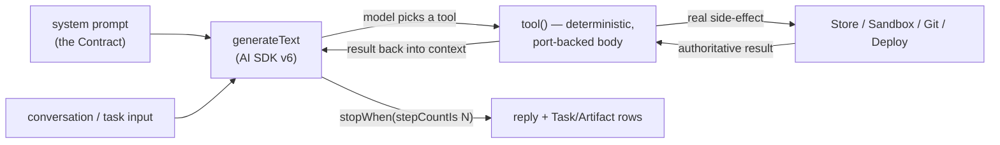

# Building agents — Lu's handbook

> Part of the Lu Computer canon. **Why**: [MANIFESTO](../MANIFESTO.md) · **What/spec**: [FOUNDATION](../FOUNDATION.md) ·
> **Status**: [DEVELOPMENT](../DEVELOPMENT.md) · **Order**: [ROADMAP](../ROADMAP.md). Reference for the
> backend's parts: [agent-backend.md](./agent-backend.md); the product surface: [canvas.md](./canvas.md).

This is the **opinionated base** for how we build and run agents on Lu — the patterns, the discipline, and
the repeatable recipe. It is scoped for now to the **engineering team** (Lu + the Engineer + coding agents in
sandboxes); Design/Support/Finance/etc. follow the *same* patterns and get added the same way (§7). Everything
here is grounded in code that runs today — where reality differs from the ambition, this doc says so.

---

## §0 — The doctrine (the opinions, up front)

1. **An agent IS a tool-loop.** Not a framework, not a graph — a `generateText` call (Vercel AI SDK v6) with a
   system prompt, a set of `tool()`s, and a stop condition. If you understand one agent, you understand all of them.
2. **The model picks the tool; the result lives in code.** A tool's body is deterministic and port-backed. The
   LLM decides *what* to do; *how* it happens and *what's authoritative* is our code. Never let the model be the
   source of truth for a side-effect.
3. **Data only through the `Store`; the world only through `ports`.** No agent touches the DB or an external API
   directly. This is what makes agents testable (swap `MemoryStore`), safe (scoped tokens), and swappable (e2b→Fly).
4. **Long work is async and durable.** A build runs minutes-to-hours; it must survive a redeploy. Dispatch off the
   request path onto a durable worker; write progress to `Task`/`Artifact` rows the web reads live.
5. **Humans gate the irreversible.** Publishing, merging, charging → an **`Approval`**. The gated action only runs
   when the owner resolves it. Staged and legible by design.
6. **Orchestration is recursive.** Lu conducts agents; an agent can conduct sub-agents (a child `Task` via
   `parentTaskId`) and even drive a live terminal. Same primitive at every level.

Everything below is these six opinions, made concrete.

---

## §1 — Anatomy of an agent (the 5 parts)

Every agent is defined by five things (the cofounder model, our files):

| Part | What it is | Where it lives |
|---|---|---|
| **Contract** | the identity file — role, duties, boundaries (Always/Ask-first/Never), voice, knowledge. Compiles into the system prompt. | `Agent.contract` + `ContractRevision` (`packages/db`); assembled in `packages/core` |
| **Model** | its reasoning model (+ generation models), chosen per-agent, swappable on the fly | `Agent.models` via the gateway (`packages/core/src/models.ts`) |
| **Tools / Ports** | its real actions — deterministic bodies over the ports (§3) | `apps/api/src/agent/*Tools.ts` |
| **Skills** | reusable guidance for a kind of work (a playbook the tool loop can pull) | *not built yet — see §8* |
| **Department** | the operating area that groups the agent + its work on the canvas | `Department` row (`key`, `status`) |

> **The distinction to keep straight** (cofounder's, and ours): *an agent is the worker · a skill is reusable
> guidance attached to it · a department is the area that groups agents and their tasks.*

---

## §2 — The agent loop (how one turn runs)



A turn is: **contract → `generateText` with tools → the model calls tools → each tool does a real thing through a
port and returns the authoritative result → loop until `stopWhen` → persist the reply + any `Task`/`Artifact`
rows.** Model tiering by role: **orchestrator = Sonnet, coding = Opus, routine department turns = Haiku** (cost).

---

## §3 — Tools & ports (the discipline)

A **tool** is the model's lever; its **body is code**. A **port** is the clean seam to the outside world behind
which the real adapter lives. The Engineer's ports:

- **`Sandbox`** (`apps/api/src/sandbox/`, e2b) — `spawn(template, repo, token)`, `exec(cmd)`, `pty()`, `kill`. A
  real isolated cloud machine per task; a local stub for tests.
- **`Git`** (`apps/api/src/git/`) — `createRepoFromTemplate`, `openPR`, `mergePR`, `getDiff`, `installationToken`.
  Prod = Octokit; local = `gh` CLI.
- **`Deploy`** (`apps/api/src/deploy/`, Vercel REST) — `createProject`, `getPreviewForPr`, `promoteToProd`, `addDomain`.
- **`Data`** (Supabase Management API) — *console-view only today* (`apps/api/src/console/`); the build path does
  not yet provision a backend into the org's Supabase.
- **Model gateway** (`packages/core/src/models.ts`) — a provider-agnostic registry (provider · modality · tier ·
  cost · best-for) + per-role recommendation. Text: Anthropic / OpenAI / Google. Image: `gpt-image-1` (real);
  Flux / Higgsfield are placeholders. *(xAI/Grok is on the roadmap, not in the gateway yet.)*

**How to add a tool.** Define a `tool({ description, inputSchema, execute })` in the agent's `*Tools.ts`; the
`execute` body calls a **port** or the **Store** and returns the authoritative result; keep it **idempotent** (a
re-run must not double-create). Never put business truth in the model's text — put it in the returned object.

**How to add a port.** Create `apps/api/src/<name>/` with an `index.ts` that exports a factory returning the port
interface, a real adapter, and a test stub. Resolve it per-org where BYO applies (`getGitForOrg(store, orgId)`).

---

## §4 — The Engineer (the reference implementation)

The Engineer turns *"build me X"* into a deployed thing. It is the pattern every future agent copies.

```
Lu / you: "build my marketing site"
  → create_site        → a real GitHub repo from a template + a Site row (status: building)
  → run_coding_agent   → an e2b sandbox boots, clones the repo, runs the Claude Code CLI headless,
                         commits + pushes lu/build   (transcript → an agent_session Artifact)
  → generate_image     → hero image (gpt-image-1 real; Flux/Higgsfield placeholder)
  → open_preview       → a real PR + a Vercel project + preview deploy   (pr_diff + site_preview Artifacts)
  → Task → needs_approval
  → you click Publish  → confirmPublish: merge PR → promote to Vercel prod → attach domain   ✅
```

- **Runtime** (`apps/api/src/agent/engineering.ts`, `engineeringTools.ts`): a `generateText` tool-loop on **Opus**,
  `stepCountIs(10)`, a 15-min ceiling, re-throwing tool errors so a hung build fails clean.
- **The six tools** map 1:1 to the flow above. `confirmPublish` is **not** a model tool — it's a server action run
  only when the owner resolves the `Approval` (`routes/approvals.ts` → `engineering.ts`).
- **Two entry modes, one runtime:** *autonomous* (a Task, headless coding agent) and *interactive* — the canvas
  **terminal** (`wss /api/terminal` ↔ e2b `pty()` ↔ xterm.js), where you watch and type into the same sandbox.
- **Activation (in-product wiring):** the web Lu dock → `POST /api/lu` (real orchestrator) → a real Task; the dock
  reads real Store rows via `GET /api/dock/{tasks,artifacts,approvals,sites}` (live poll); a **Publish** button →
  `POST /api/approvals/:id/resolve`. This is the whole thesis, real.

**BYO reality (today):** repos + deploys go into the **customer's own** GitHub + Vercel, connected by **token-paste**
(not OAuth yet — see [byo-connect.md](./byo-connect.md)). The Engineer is only dispatchable once GitHub **and**
Vercel are connected (`connect/status.ts`). Known-fragile edges for a real external user (hardcoded starter
template, the `{slug}.lu.computer` domain on the owner's Vercel, the Vercel↔GitHub link, the short preview poll)
are tracked in [DEVELOPMENT.md](../DEVELOPMENT.md) §"BYO connect" / §"critical path".

---

## §5 — Orchestration (running a team)

**Lu is the top conductor** (`apps/api/src/agent/orchestrator.ts`, Sonnet). A goal → a plan → real `Task` rows
routed to agents. Its tools (`orchestratorTools.ts`): `create_task`, `assign_to_department`, `check_connections`,
**`dispatch_to_engineering`** (agent→agent — hands the Engineer a task *inside the runtime*), `list_status`,
`ask_user` (renders as a question in the Lu dock).

**Recursion is the whole trick.** An agent is a program you compose on the fly: it runs any model (`Agent.models`)
and can **spawn sub-agents** (a child `Task` via `parentTaskId`) and **attach/drive a cloud terminal's pty**. On
the canvas, who-conducts-whom is drawn as **`Edge`s** between nodes. Lu runs the top; every agent can run the ones
beneath it. *(Multi-agent `spawn_agent`/supervision is the next rung — see [DEVELOPMENT.md](../DEVELOPMENT.md).)*

---

## §6 — Durability & approvals (running it for real)

A build runs for minutes-to-hours; it must survive a redeploy and resume — that's what makes "work while you sleep"
real. We get it with **BullMQ + Redis**, borrowing the *durability semantics* from Trigger.dev / Inngest without
adopting a whole engine.

**What durable execution buys us, three cheap ways:**
1. **Re-delivery** — BullMQ only acks a job on success; a dead worker leaves the job for a new worker to pick up.
   (The whole "survives a crash" win.)
2. **Idempotent steps** — "already done?" is derived from **domain state we already persist** (a Site/Deployment/
   Approval row), not a separate step log. No new tables. `create_site` reuses an existing repo for org+slug; the
   build branch is `checkout -B lu/build`; `open_preview` reuses the Vercel project.
3. **Wait-for-approval as a run boundary** — the build **ends** at `request_publish` (stages an `Approval` and
   stops). `confirmPublish` is a *separate* run when the owner resolves it. "Pause for hours, then resume" is two
   runs with an `Approval` between — no mid-run suspend needed.

**Implementation:** `queue.ts` (the `engineering` queue; `jobId = taskId` so a task is never double-dispatched;
`attempts: 3` + backoff) · `worker.ts` (`startEngineeringWorker(store)`, `lockDuration: 300_000`; on exhausted
retries the task → `failed`; runs in-process beside the API, splittable to `node dist/worker.js` later) ·
`dispatch.ts` / `routes/agents.ts` (enqueues when `REDIS_URL` is set, **falls back to in-process** when it isn't —
same `202 {taskId}` contract).

> **⚠️ Status:** the worker is **built but inactive** in the current deployment — `REDIS_URL` is unset, so builds
> run in-process fire-and-forget (a crash mid-build loses the run). Setting `REDIS_URL` (Railway Redis / Upstash)
> activates durability. `ENGINEERING_CONCURRENCY` (default 3) caps parallel builds. See [DEVELOPMENT.md](../DEVELOPMENT.md).

**Not built yet:** step-memoization for `run_coding_agent` (a mid-build crash re-runs the coding agent — it
converges but redoes work); the event-sourced replay upgrade lands when re-run cost bites.

**Approvals** are the human gate: any task whose boundaries mark an action risky/outward-facing creates an
`Approval` and sets `Task.status = needs_approval` → a "Needs you" row in the dock. Routing by role: publish/spend
→ the owner.

---

## §7 — ⭐ How to add a NEW agent (the recipe)

The payoff of the doctrine: a new department agent is a **repeatable checklist**, not a project.

1. **Contract** — write the agent's `CONTRACT.md` (role · duties · boundaries Always/Ask/Never · voice · knowledge).
   Keep it < ~150 lines. Store as `Agent.contract`.
2. **Model** — pick its reasoning model in `Agent.models` (routine work → Haiku; heavy → Sonnet/Opus). Add
   generation models if it produces assets.
3. **Tools / ports** — define its `*Tools.ts`: deterministic, idempotent, port-backed bodies (reuse `Store` +
   existing ports; add a new port only if it reaches a new system).
4. **Department row** — a `Department{ key, status }` + a default `Agent`; provision it (extend
   `onboarding/provision.ts`).
5. **Dispatch wiring** — give Lu a way to route to it (`assign_to_department` already exists; add a
   `dispatch_to_<dept>` if it needs agent→agent like the Engineer).
6. **Canvas surface** — it appears as a department pill; add its Home/workplace cards if it has an app
   ([canvas.md](./canvas.md)).
7. **Approvals** — mark which of its actions are outward-facing/irreversible so they stage an `Approval`.

That's it — the runtime, the loop, the dock, and durability are all shared. You're only writing the contract, the
tools, and the wiring.

---

## §8 — Skills (the next rung)

**Skills** = reusable guidance attached to an agent for a *kind* of work (a playbook the tool-loop pulls when it
matches). Cofounder has them; Lu does not yet. When we add them: a `Skill` is markdown + an optional matcher, and
the loop injects the relevant one(s) into context. Flagged here so the anatomy (§1) is complete; tracked in
[ROADMAP.md](../ROADMAP.md).

---

## Quickstart (the sequence)

1. **Connect** GitHub + Vercel (token-paste, in Settings or onboarding). *(Only needed once, for real builds.)*
2. **Tell Lu the goal** in the dock — "build me a website."
3. Lu **creates tasks + dispatches** the Engineer (`create_task` + `dispatch_to_engineering`).
4. The Engineer **loops** — sandbox → coding agent → PR → preview — writing `Task`/`Artifact` rows you watch live.
5. **Review** the preview + PR diff on the canvas / dock.
6. **Approve** → Publish → live. **Iterate** — ask for a change; it's another loop.

Same sequence for every future agent — only the department and the tools change.
