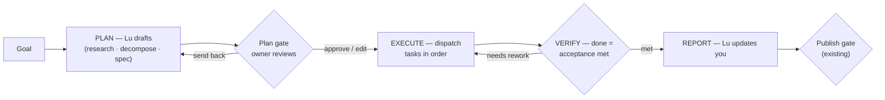

# Lu Computer — planning & the plan gate

> Part of the Lu canon. **Status: BUILT (2026-07-17)** — the whole plan gate ships: `propose_plan` + the
> `approve_plan` gate + dispatch-on-approval + the plan-review card (Approve / **Request changes** → re-plan /
> Reject) + the actionable roadmap + **acceptance verification** (§5 — `verify_acceptance` judges the build
> against the criteria and reworks until it passes before publish). Remaining: only the cosmetic enum
> precision (`planned` status / `Task.acceptance` column — functionally covered). Tracked in [DEVELOPMENT.md](../DEVELOPMENT.md).
> This specs the **planning slice** of the agent workflow — how a goal becomes an *approved plan* before any
> build runs. It defines clean **seams** (§7) to the broader agent-workflow (agent→Lu reporting, task
> verification, chat states, approval surfacing) so the two compose rather than collide. Handbook:
> [building-agents.md](./building-agents.md).

## The problem today (why it's shallow)

Lu decomposes a goal into `Task` rows in **one turn** (`create_task`) and calls `dispatch_to_engineering`
**immediately** (`agent/orchestratorTools.ts`). There is **no reviewable plan, no plan-approval gate, no
spec, no plan-vs-execute mode**; the Engineer builds directly. The **only** human gate is `request_publish`
at the *end* — so a build burns time + compute + a preview deploy before you ever see the approach. The
manifesto's *"a manager that turns intent into a plan"* is aspirational until this lands.

## The shape — the plan lifecycle

The one-line change to today's flow: **insert PLAN + a gate before EXECUTE**, and make "done" mean
*acceptance met*, not *agent stopped*.

## 1. The Plan (a first-class artifact)

A **Plan** is what Lu produces from a goal before anything runs:
- **Objective** — one line.
- **Spec / acceptance criteria** — what "done" looks like, testably (the input to verification, §5).
- **Steps** — an ordered decomposition; each step is a **draft `Task`** with an owning department, its
  dependencies (`needs_earlier`), and its expected output.
- **Open questions** — the `ask_user` items that still need a decision.

Stored as: the child `Task` rows in a new **`planned`** status (drafted, *not* dispatched) under a parent
task, plus a **`plan` `Artifact`** holding the objective + spec, so the whole plan is one reviewable object.

## 2. Lu plans (the tool + the mode)

A new orchestrator tool **`propose_plan`** (a "Plan mode"): for a non-trivial goal Lu **researches first**
(reads the repo/context, calls `ask_user` for genuinely-missing decisions), then **drafts the Plan** instead
of dispatching. Trivial/obvious goals may skip straight to execute — Lu decides, or the owner pins Plan mode
(cofounder's pattern). This replaces the current "decompose-and-dispatch in one breath."

## 3. The plan gate (permission at the *start*)

The Plan stages a **plan `Approval`** — a new `Approval.action = "approve_plan"`, reusing the existing
approval primitive and dock surface. The owner can:
- **Approve** → the plan's tasks become dispatchable.
- **Edit** → change objective/steps/acceptance; the tasks update in place.
- **Send back** → request changes; Lu re-plans (loop).

**Nothing dispatches until the plan is approved.** This is the "real permission/structure" that's missing —
you approve the *approach*, not just the finished publish.

## 4. Execute (dispatch the approved plan)

On plan approval, Lu dispatches the `planned` tasks in **dependency order** to their owning agents (today:
Engineering). Each task carries its **acceptance criteria** from the spec, so the executor knows the bar.

## 5. Verify — "done" = acceptance met  *(seam → the workflow spec)*

A task is **not** `done` because the agent stopped — it's done when its **acceptance criteria are met**: the
build compiles, tests/lint pass, the preview deploys, and (where used) an LLM-judge or explicit checks
confirm the spec. Planning **produces** `Task.acceptance`; **how** verification runs (tests · judge · checks
· the `needs_rework` loop) belongs to the broader workflow spec. Seam: `Task.acceptance` → verify →
`done | needs_rework`.

## 6. Report + chat states  *(seam → the workflow spec)*

The plan lifecycle **emits** the states the chat should show:
`planning · researching · awaiting_plan_approval · executing (per task: building · verifying) ·
needs_approval (publish) · done | needs_rework`. Planning **defines** these states and the plan/task tree;
**rendering** them (Lu's live "she's planning / researching / writing tasks" status, the plan-review card,
surfacing both the *plan* approval (start) and the *publish* approval (end) in the approval rows) belongs to
the chat + workflow spec.

## Data-model additions (small, additive)

- `Task.status` — add **`planned`** (drafted, not dispatched).
- `Task.acceptance` — Json/text: the "done" criteria.
- `Artifact.kind` — add **`plan`** (objective + spec), or model the plan as the parent task's payload.
- `Approval.action` — add **`approve_plan`**.

No new tables; all additive to the existing agent-OS schema ([agent-backend.md §2](./agent-backend.md)).

## 7. Seams to the broader agent-workflow (what planning HANDS OFF)

Planning owns the plan gate; it deliberately **does not** specify these — it defines the interface so the
workflow spec can:
- **Verification** — consumes `Task.acceptance`; owns how "done" is proven + the rework loop (§5).
- **Reporting (agents → Lu → you)** — consumes the plan + task tree; owns how sub-agents report status up and
  how Lu narrates progress back (§6).
- **Chat states** — consumes the lifecycle states (§6); owns the live status UI + the plan-review card + which
  approvals surface where.

## 8. The roadmap *is* the live plan — every "next" is a Lu action

The dock's **Roadmap %** + **Suggested Next** are **static nudges** today (e.g. "Connect GitHub" just links to
Settings). They should be the **visible plan**, and **every step a Lu action**: clicking a "next" doesn't
merely navigate — it **prompts Lu with that step's intent**, and Lu takes it from there (walks you through
connecting GitHub, asks the one decision it needs, or dispatches the work), gated by the same plan/approval
flow. Concretely:
- Each roadmap / next item carries a **Lu intent** (a prompt/goal) + a live status — not just a link.
- **Click → inject the intent into the Lu thread → Lu runs the workflow** (`ask_user` · guide · `propose_plan`
  · dispatch). "Connect GitHub" → Lu explains, opens the connect step, and confirms when it's done.
- The roadmap **advances off real state** (org connected, task done) — same source of truth as the plan, so a
  step checks itself off when the underlying thing actually happens.

Same principle as the plan gate: **the surfaces drive real Lu actions, never decoration.** (The rendering —
which nudge shows where, the click→thread wiring — is a chat/workflow seam, §7.)

## Build order (after the broader shape settles)

1. `propose_plan` tool + the `plan` Artifact + the `planned` task status. *(no gate yet — dry-run the plan)*
2. The plan gate: `approve_plan` Approval + the dock **plan-review card** (objective · steps · acceptance;
   approve / edit / send-back).
3. Dispatch-on-approval, in dependency order.
4. Emit `Task.acceptance` per task → hand to verification (the workflow spec).
5. Wire the lifecycle states → the chat (the chat/workflow spec).
