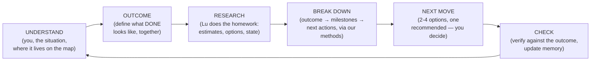

# The Roadmap — the Loop, the Map, and the first authored World

> The master document for how a person and Lu interact — from the first second, at every level of
> abstraction. This is not a product-order roadmap (features to ship). It is the **authored script of
> interaction**. We are the game designers; we author the paths. Lu executes them — adapting words and
> options to each person and company — but never inventing the path. Companions:
> [product.md](./product.md) (surfaces) · [system.md](./system.md) (the machine) ·
> [COMPANY.md](../COMPANY.md) (why) · [paper.md](../paper.md) (the theory this instantiates).

---

# PART I — THE LOOP (the universal primitive)

Every interaction with Lu — building a company, shipping a feature, managing your money, planning your
life — is the **same loop**. It starts before any company exists: it starts with *you*.

**Grounding.** This is not an invented sequence — it's the spine that every serious framework for
breaking down high-level goals shares. [HTN planning](https://www.sciencedirect.com/science/article/pii/S0004370215000247)
(how AI planners do it): a high-level task decomposes through a library of *authored methods* into
executable actions — the decomposition knowledge is written by domain experts, the planner navigates
it. [GTD](https://sugarokr.com/blog/okrs-vs-other-popular-goal-setting-methodologies/) (how organized
people do it): the two questions are *"what does DONE look like?"* and *"what's the very next
action?"*. [OKRs + Locke & Latham goal-setting theory](https://www.okrstool.com/blog/goal-setting-frameworks)
(how companies do it): define the outcome first, make it specific, and feed progress back constantly.
OODA and PDCA add the wrapper: observe/orient before deciding, check after acting. The common spine:
**situate → define done → figure out how → do the next concrete thing → check → repeat.** That is the
loop, and our authored scripts are HTN's "method library" — we write the decomposition knowledge; Lu
is the planner walking it.



**Step 1 — UNDERSTAND.** Lu learns who you are, what the situation is, and where it lives on the
**field map** (Part II — personal, work → engineering, a whole company…). The field decides everything
downstream: which questions exist, which agents and tools apply, where documents file, which
situations she watches for. Day one this is literal — she asks. Day one hundred it's implicit — she
knows. (OODA's observe + orient.)

**Step 2 — OUTCOME.** Before any plan, define what **done** looks like — stated, agreed, written
down. "Launch the MVP in 90 days." "Ship billing." "Finances organized by March." This comes EARLY —
you don't scope details before knowing the destination. A field's scoping questions exist to serve
this step: they're the minimum needed to make the outcome definable and honest. (GTD's "what does
done look like"; the OKR objective; the paper's Goal → Outcome tier.)

**Step 3 — RESEARCH.** Lu goes and figures things out — her homework, not yours: market estimates,
comparables for pricing, reading your repo, checking what's connected and what exists. The output is
*informed options*, not vibes. This is why the interview's market-size question works the way it does:
she proposes the estimate, you adjust. (The step that separates a cofounder from a form.)

**Step 4 — BREAK DOWN.** The outcome decomposes into milestones and next actions — *through the
methods we authored* (the chapters, the scripts, the situation rules). Lu never invents the
decomposition path; she instantiates ours with the company's specifics. (HTN: authored methods,
planner navigates; goal-setting theory: proximal subgoals.)

**Step 5 — NEXT MOVE.** The smallest concrete decision, now: 2-4 tappable options, exactly one
**recommended** — she thinks, you decide. A move is an **answer** (refines scoping), a **connection**
(wires a real account), or a **work order** (becomes plan → approve → build → verify → publish).
(GTD's "next action"; OODA's decide-act.)

**Step 6 — CHECK.** The result is verified against the outcome — empirically where possible (our
verification loop) — memory and state update, and the loop re-enters UNDERSTAND. She never asks what
she can derive, and the loop tightens the longer she runs. (PDCA's check; Locke & Latham's feedback.)

## The two rings (what the research added)

Deep research across company operating systems (EOS/OKR), every business function, and personal
systems (GTD/YNAB/training) found the same structure everywhere: the loop above is actually **two
nested rings running at different speeds**:

- **The execution ring** — the six steps above, run per piece of work, fast (a build, an invoice, a
  ticket, a workout). This is where moves happen.
- **The review ring** — a slower, *scheduled* rhythm that looks at the execution ring from above:
  - the **heartbeat** (weekly, almost universally): compare plan vs. actual on a small scorecard,
    surface issues, commit the next moves. EOS runs it as the Level-10 meeting (fixed agenda:
    scorecard → priorities → issues → to-dos); OKR teams that check in weekly complete ~43% more
    objectives than monthly ones; GTD calls it the weekly review.
  - the **reset** (quarterly, universally): grade the outcomes (EOS targets ≥80% Rock completion),
    keep/kill, and set the next 90-day outcomes. This is where OUTCOME gets re-run deliberately
    rather than reactively.

Two universal primitives ride the review ring, found in every domain researched:

1. **The scorecard** — 5-15 numbers per field, checked at the heartbeat, that make the field's health
   legible at a glance. They split into *flow* metrics (lead time, response time, conversion) and
   *staleness* signals (nothing overdue, no unreviewed SOPs, no unsigned contracts).
2. **The obligations calendar** — recurring TIME-triggered duties (renewals, filings, the monthly
   close, deloads). These are situations that fire on dates, not events — a second class our
   situation system must carry.

**The rules of the loop** (hold at every level):

- **Lu speaks first.** Silence is never the state; a blank chat box is a design failure.
- **She thinks; you decide.** Every question ships her recommendation. Every gate is yours.
- **State is derived, never invented.** Her place in any script is computed from real data —
  reload-safe, unlosable.
- **Checkpoints, not noise.** Moves appear when an authored beat or situation matches. Plain questions
  get plain prose.
- **One frontier.** The current moves are the single source for chat chips, the Home next-list, and
  her proactive nudges.
- **Everything durable lands in the Library**, filed by field.
- **The loop is invisible.** No progress bars, no map screens. It manifests only as: who speaks
  first, what she asks, and which moves she offers.

---

# PART II — THE MAP (fields and worlds)

The map is the tree of domains Lu can operate in. Every intent you bring her lands somewhere on it,
and **the field it lands in decides everything downstream**: which questions get asked, which agents
and tools do the work, where the documents file, which situations she watches for, and what "done"
even means. This part defines the map formally — because if the field decides everything, the map is
the most load-bearing authored object in the product.

## What a field IS

A **field** is an authored domain of operation. It exists only if we wrote it. Formally, a field is a
path from the root (`work/company/engineering`, `personal/finance`) plus **seven authored things** and
**four pieces of live state**:

**The seven authored things (what WE write — a field without all seven isn't a field):**

| # | Authored thing | What it is | Example (work/company/engineering) |
|---|---|---|---|
| 1 | **Scoping script** | the minimum questions that make this field's outcomes definable | which repo? the stack? what are we shipping first? |
| 2 | **Outcome vocabulary** | the kinds of "done" that exist here | a shipped feature · a green deploy · a fixed bug |
| 3 | **Agents + tools** | who does the work, through which real capabilities | the Engineer; sandbox, git, deploy, data ports |
| 4 | **Library folder** | where this field's documents file | Engineering (architecture, specs, migrations) |
| 5 | **Situations** | the authored checkpoints Lu watches for — **two classes**: event-triggered (something happened) and time-triggered (the obligations calendar) | build failed · preview ready / (later) dependency audit due |
| 6 | **Cadences** | the field's two rings: how fast the execution loop cycles, and when the review ring beats (heartbeat + reset) | per build · weekly DORA glance · per-cycle retro |
| 7 | **Scorecard** | the 5-15 numbers that make the field's health legible — flow metrics + staleness signals | deploy frequency · lead time · verify pass rate |

**The four pieces of live state (what accumulates per company/person — never authored):**

| # | State | What it is |
|---|---|---|
| 1 | **Context doc(s)** | the field's scoped truth, in its folder (Business Context, Architecture…) |
| 2 | **Current outcome** | the agreed next high-level result this field is driving toward |
| 3 | **Open work** | tasks, approvals, questions in flight |
| 4 | **Memory** | everything Lu has learned operating this field |

## The tree

```
YOU  (the root — the person; understood once, remembered always)
│
├── work
│   ├── company            ← THE BUSINESS WORLD (live today — Part III is its script)
│   │   ├── engineering    ← live (the Engineer)
│   │   ├── finance        ← future: money in/out, invoicing, burn
│   │   ├── sales          ← future: pipeline, outreach, closing
│   │   ├── marketing      ← future: content, channels, launches
│   │   ├── design         ← future: brand, assets, product design
│   │   ├── support        ← future: customers' questions, issues
│   │   ├── operations     ← future: the running of the thing
│   │   └── legal          ← future: contracts, compliance
│   ├── studio / dev       ← future world: build software with no company wrapper
│   └── career / practice  ← future: the job, freelancing, the craft
│
└── personal
    ├── goals              ← future world: what you want, tracked and driven
    ├── finance            ← future: personal money
    ├── health             ← future
    └── learning           ← future
```

Three depths, three natures:

- **The root (YOU)** is not a field — it's the person: identity, preferences, priorities, and what you
  want with Lu. Understood at first contact, enriched forever, readable from *every* field. One
  person, one memory, many worlds.
- **Worlds** (the presets from the vision — Business · Studio/Dev · Personal · Custom) are fields big
  enough to have sub-fields and a long setup arc of their own. `work/company` is a world; its setup
  arc is Part III chapters 0-4.
- **Sub-fields** are where work actually happens. The Business world's sub-fields are the departments;
  the Library's folders mirror this level exactly (General = the world level, Engineering = a
  sub-field; every future department brings its folder when it activates).

Full grounded definitions for every field — researched, not sketched — live in **THE FIELD BOOK**
below (after the fractal principle).

## Mapping — how Lu routes an intent

Mapping is step 1 of the loop resolving to a path. The rules, in order:

1. **Context wins.** Inside a world, ambiguity resolves within it ("fix the pricing page" while
   running a company → `work/company/engineering`, not a philosophy discussion).
2. **The most specific field that fully contains the intent wins.** "Invoice my client" →
   `work/company/finance`, not `work/company`.
3. **Explicit beats inferred.** At first contact — or whenever you say so — the world is chosen
   out loud. (Today sign-up does this: the product currently IS the Business world. When more worlds
   exist, "what do you want to do with me?" becomes a real beat with world options.)
4. **When she can't place it, she asks — with options.** One question, 2-4 candidate fields, one
   recommended. Mapping failures are never silent guesses.
5. **Cross-field intents decompose.** "Hire a designer" touches operations (the hiring) and finance
   (the cost); the primary field owns the work, the others get their pieces as moves. (v1: flagged,
   not automated.)

## Nesting rules — what flows down the tree

1. **Context flows down.** A child field reads its ancestors' context docs (the Engineer reads the
   Business Context) and the root's person-context. Never the reverse — a parent doesn't inherit a
   child's internals, it sees the child's outcomes.
2. **Outcomes cascade.** A child field's current outcome must serve its parent's ("ship the landing
   page" serves "launch the MVP in 90 days"). This is the OKR cascade, enforced by authorship: Lu
   proposes child outcomes *derived from* the parent outcome, never orthogonal to it.
3. **Situations bubble up.** A child's situation can surface at the parent's level when it needs the
   owner (a build failure interrupts the company conversation — you don't have to be "in"
   engineering to hear about it).
4. **The Library mirrors the tree.** Field path = folder path. Filing is never a decision; it's
   determined by the field that produced the document.

## Activation — fields turn on, they don't preexist

A field is **dormant** until its world's script activates it (departments activate when the owner
accepts the activation gate; a future Finance department activates when its field is scoped). Activation = its seven
things go live: the folder appears, the situations arm, its agents become dispatchable. Dormant
fields are invisible — no empty shelves, no dead UI. This is why the Library shows General +
Engineering today and grows folder-by-folder as departments come online.

**We author fields; Lu navigates them.** Adding a domain to Lu = authoring the seven things (a skill
file, an outcome vocabulary, tools, a folder, situations). She never invents a field. ("Lu extends
the map herself" — same status as "Lu adds to the roadmap": parked, an idea, not designed.)

## Every field IS a loop (the fractal principle)

The tree is not a tree of categories — it's a **tree of running loops**. Every field runs its own
instance of the Part-I loop (understand → outcome → research → break down → next move → check), at
its own cadence, over its own outcome vocabulary. The company runs a slow loop over 90-day outcomes;
engineering runs a fast loop per build; support (one day) will run the fastest loop per ticket. The
root runs the slowest loop of all — your life with Lu.

**How loops nest (the two edges):**

- **Spawn down.** A parent loop's NEXT MOVE can start a child loop: the company loop's "ship the
  landing page" move spawns an engineering loop with its own outcome (the acceptance criteria), its
  own research (read the repo), its own break-down (the plan), its own check (verification).
- **Report up.** A child loop's CHECK lands in its parent's UNDERSTAND: the build verified/published →
  the company loop learns it and re-plans its frontier. Failures bubble the same way (the situations
  rule from the nesting section — you hear about a broken build without being "in" engineering).

This is not aspiration — **engineering's loop is already built, 1:1**: brief = understand ·
acceptance criteria = outcome · reading the repo/architecture = research · the plan's steps = break
down · the build = move · `verify_acceptance` (empirical) + the publish gate = check · rework = the
loop going around again. The whole design here is generalizing something that already runs.

**Each branch's loop of execution** (one line each — its path around the loop + cadence):

| Field | Its loop, in one line | Cadence | Status |
|---|---|---|---|
| **YOU (root)** | understand who you are + what matters now → the season's priorities → allocate attention across worlds → check-ins re-balance | slowest — quarterly/life | folded into sign-up today |
| **work/company** | scope the company → 90-day outcome → research market/state → break into department work → approve moves → results roll up | weeks | **live** (Part III) |
| **· engineering** | brief → acceptance criteria → read repo/architecture → plan → build → verify → publish → report | per build (hours-days) | **live** |
| **· finance** | understand money in/out → books-closed / burn target → reconcile + categorize → invoices/bills to act on → approve → month closes | monthly + per invoice | future |
| **· sales** | understand pipeline → the quarter's revenue outcome → research prospects → next outreach/deal moves → close/lose → pipeline updates | weekly + per deal | future |
| **· marketing** | understand audience/channels → the launch/growth outcome → research content+channels → campaign break-down → publish → measure | per campaign | future |
| **· design** | brief → the asset/identity outcome → reference research → drafts as moves → owner picks → files to Library | per brief | future |
| **· support** | a ticket arrives → resolution is the outcome → research the case → answer/escalate → owner only on escalation → learnings accrue | per ticket (minutes) | future |
| **· operations** | understand how the company runs → the process outcome (hiring, vendors, tools) → research options → decide → it becomes routine | per process | future |
| **· legal** | a contract/need arrives → signed/compliant is the outcome → research terms → redlines as moves → sign gate → filed | per matter | future |
| **work/studio-dev** | the company loop minus the company: project → outcome → build → ship, no departments | per project | future world |
| **personal/goals** | what do you want → the season's goal → break into weekly moves → check-ins → adjust | weekly review | future world |
| **personal/finance · health · learning · admin** | the same shape over money / body / skills / life-admin | monthly / daily / weekly | future |

## THE FIELD BOOK — grounded field definitions

Every field's seven things, drawn from research into how each function actually operates in real
small companies and real organized lives — not sketched. Format per field: **loop** (execution ring)
· **cadences** (execution / heartbeat / reset) · **artifacts** (→ its Library docs) · **scoping
questions** (→ its scoping script) · **scorecard**. Sources linked per field.

### `work/company` — the world loop
- **Loop:** vision → 90-day outcomes → weekly execution → measure → quarterly reset.
- **Cadences:** moves daily/weekly · **heartbeat weekly** (the review: scorecard → outcome progress →
  issues → next commitments — the EOS Level-10 agenda, adapted) · reset quarterly (grade outcomes,
  ≥80% target, set the next ones) · vision annually.
- **Artifacts:** the Business Context doc (our V/TO), the scorecard (5-15 measurables with owners),
  the outcome list, a running issues list.
- **Scoping:** the Chapter-1 interview (plus, later: which 5-15 numbers prove the business works? who
  is accountable for each function? when's the weekly review?).
- **Scorecard:** % measurables on track · outcome completion % · issues resolved/week · moves
  completed vs committed.
- Sources: [EOS Level-10](https://www.eosworldwide.com/level-10-meeting) ·
  [OKR cadence](https://www.whatmatters.com/okrs-explained/okr-timeframe)

### `work/company/engineering` — live
- **Loop:** shape the brief (with a fixed appetite) → plan/bet → build → verify → ship → cool-down.
- **Cadences:** per build (hours-days) · heartbeat = per-cycle review + a weekly DORA glance · reset
  with the company quarter.
- **Artifacts:** Architecture doc · plans/briefs (appetite, rabbit holes, no-gos) · decision records ·
  runbooks (later).
- **Scoping:** which repo/stack? what's the deploy path — one step to prod? what must never break
  (payments, auth) vs fix-forward? what's the appetite per bet? where do decisions get recorded?
- **Scorecard (DORA):** deploy frequency · lead time (<1 day good) · change-failure rate (~5%) ·
  verify pass rate · bets shipped inside their box.
- Sources: [Shape Up](https://basecamp.com/shapeup/2.2-chapter-08) ·
  [DORA metrics](https://octopus.com/devops/metrics/dora-metrics/)

### `work/company/finance` — future
- **Loop (monthly close):** capture transactions → reconcile (bank/AR/AP) → adjust → report (P&L,
  balance sheet, cash flow) → review burn/runway → act (chase, cut, reforecast). Sub-loops: AR
  (deliver → invoice → track aging → dun → collect) · AP (bill → verify → approve → pay).
- **Cadences:** weekly AR-chase + AP-run + cash check · monthly close (target day 5-10) · quarterly
  reforecast (trigger: ≥10% variance twice) · annual budget + rolling 12-month forecast.
- **Artifacts:** P&L · balance sheet · cash-flow forecast · AR/AP aging · budget-vs-actuals ·
  invoices.
- **Scoping:** entity/banks/tool today? cash or accrual? who pays you, on what terms, and who do you
  pay? current cash + average monthly spend? what runway threshold triggers action?
- **Scorecard:** gross/net burn · **runway months** (start raising at ~12 left) · DSO/AR aging ·
  budget variance · close done on time.
- Sources: [month-end close](https://ramp.com/blog/month-end-close-process) ·
  [runway](https://kruzeconsulting.com/blog/startup-runway/)

### `work/company/sales` — future
- **Loop:** prospect → outreach cadence (8-12 touches over 14-21 days, multi-channel ≈3x replies) →
  qualify → demo → propose → close (won/lost) → log WHY → feed learnings back. Every stage has exit
  criteria; every open deal has a next action with a date.
- **Cadences:** daily protected outreach block + same-day CRM · **weekly pipeline review** (what
  moved, what's stuck, kill dead deals — "clean pipelines beat big pipelines") · monthly conversion
  analysis (which stage kills deals = the learning signal).
- **Artifacts:** the pipeline (stage definitions + exit criteria) · sequence templates · proposal
  template · win/loss log → eventually the playbook.
- **Scoping:** who exactly buys, at what price? where do the first 50 prospects come from? what makes
  a lead qualified? what's the motion (self-serve/demo/proposal)? target ACV and deals needed this
  quarter?
- **Scorecard:** stage-by-stage conversion · pipeline coverage (~3x target) · cycle length · win
  rate; weekly leading: new prospects (<20/wk = top-of-funnel problem) · reply rate (<5% broken,
  >15% double down).
- Sources: [founder-led sales](https://www.pipedrive.com/en/blog/founder-led-sales) ·
  [sales cadence](https://www.highspot.com/blog/sales-cadence/)

### `work/company/marketing` — future
- **Loop (two nested):** content: position → plan → produce → publish → measure → double-down or
  kill. Channels (Bullseye): brainstorm all 19 → cheap parallel tests on 3-6 → focus the 1-2 that
  hit. Early stage: never more than 2-3 channels at once.
- **Cadences:** weekly publish rhythm · monthly calendar + kill/keep · quarterly positioning review +
  channel bets · channel verdicts need 60-90 days.
- **Artifacts:** positioning doc (Dunford: alternatives → unique attributes → value → segment →
  category) · ICP · content calendar (3-5 themes) · campaign briefs (one success metric each) ·
  channel scorecard.
- **Scoping:** if you didn't exist, what would customers use? where did current customers actually
  come from? what single conversion counts? what can you produce weekly, realistically? budget per
  channel test + target CAC vs LTV?
- **Scorecard:** CAC per channel vs LTV (CAC > LTV = kill) · traffic→signup · signup→activation ·
  publishing consistency vs plan.
- Sources: [Bullseye](https://brianbalfour.com/essays/traction-the-bullseye-framework) ·
  [positioning](https://www.aprildunford.com/post/a-quickstart-guide-to-positioning)

### `work/company/design` — future
- **Loop:** brief/discovery → research + moodboard → concepts → feedback rounds (**capped at 3**,
  2-3-day review windows) → refine → deliver the brand kit + guidelines. Product design rides the
  engineering cycle (embedded).
- **Cadences:** per brief — brand sprint 2 weeks; full identity 8-12 weeks.
- **Artifacts:** creative brief · moodboards · concept decks · brand guidelines (logo/color/type/
  usage) · labeled asset kit · template library.
- **Scoping:** from zero or refresh — what exists? who is the ONE decision-maker (2-3 approvers max)?
  3-5 references you love/hate? which surfaces first (site, product, deck)? sprint or full program?
- **Scorecard:** rounds used vs cap · review turnaround · off-brand assets in the wild · kit usage
  (pulling from it vs recreating).
- Sources: [brand process](https://stephcorrigan.com/brand-design-process/) ·
  [two-week brand sprint](https://proofofwork.studio/writing/two-week-brand-sprint)

### `work/company/support` — future
- **Loop:** intake → triage (P1-P4 by business impact) → resolve (macros/KB first-touch) → escalate
  (with full context attached) → **learn** (KB updated, themes fed to product, resolutions flow back
  down so the front line learns).
- **Cadences:** continuous queue · daily triage sweep · weekly ticket-theme review → product.
- **Artifacts:** knowledge base · macros/saved replies · escalation policy · SLA definitions ·
  priority matrix.
- **Scoping:** which channels? what counts as a P1 for THIS business? who answers today and who's the
  escalation backstop? the 10 questions you get repeatedly? what response promise can you actually
  keep?
- **Scorecard:** first response (<1h email / <30s chat is the bar) · P1 resolution <4h, standard
  <24h · SLA compliance 90-95% · first-contact resolution 70-79% · CSAT ~80% · deflection 25-60%.
- Sources: [SLA benchmarks](https://unthread.io/blog/customer-support-sla-statistics/) ·
  [tiered handoffs](https://www.supportbench.com/tiered-support-structures-designing-l1-l2-l3-handoffs/)

### `work/company/operations` — future
- **Loop:** notice recurring pain → document it as an SOP (start where failure is most visible —
  usually onboarding) → assign an owner → run it → review + revise. Sub-loops: vendors (inventory →
  quarterly review → renewals flagged 90 days out) · hiring (source → screen → interview → offer,
  scorecards within 24h of each interview).
- **Cadences:** SOP review every 6-12 months and on any change · vendors quarterly · compliance
  calendar monthly/annually.
- **Artifacts:** SOP library · vendor/subscription register (owners + renewal dates) · hiring
  scorecards + question bank · compliance calendar · accountability chart.
- **Scoping:** what breaks or gets redone every week? what lives only in the founder's head? every
  tool you pay for — owner + renewal date? hiring in the next 6 months? recurring filings/payments?
- **Scorecard:** % recurring processes with SOP + owner · SOP staleness (>12mo) · wasted SaaS spend
  (avg. 26%!) · unreviewed auto-renewals · time-to-hire.
- Sources: [SOP guide](https://www.uschamber.com/co/start/strategy/standard-operating-procedure-sop) ·
  [SaaS spend audit](https://termedora.com/blog/saas-spend-audit)

### `work/company/legal` — future
- **Loop (contract lifecycle):** request → draft from template → review/redline → approve → sign →
  **store + track obligations** (the half startups drop) → renew or terminate. Parallel: the entity
  compliance calendar.
- **Cadences:** per matter · quarterly renewal-date sweep · annual: Delaware C-corp report +
  franchise tax (Mar 1; use the Assumed Par Value method — the default massively overcharges),
  LLC tax (Jun 1), 409A refresh.
- **Artifacts:** template library (NDA/MSA/SOW/offers/SAFEs) · contract repository with renewal
  dates · the cap table as single source of truth · compliance calendar.
- **Scoping:** entity + state? where are signed contracts now — anything operating unsigned? do all
  founders/employees have IP assignment + vesting? what renews this year? 409A / option pool?
- **Scorecard:** contracts operating unsigned · missing renewal dates · filing-deadline proximity ·
  good standing · cap table vs records mismatch.
- Sources: [CLM stages](https://www.contractsafe.com/blog/stages-contract-management) ·
  [DE franchise tax](https://kruzeconsulting.com/blog/what-is-delaware-franchise-tax/)

### `personal/goals` — future world
- **Loop:** capture everything → weekly review (GTD's three phases: get clear → get current → get
  creative) → quarterly cycle (12-Week Year: 1-3 goals, weekly tactics scored, ≥85% execution
  target) → annual review (what went well / didn't / learned).
- **Cadences:** weekly 30-90 min · quarterly reset · annual.
- **Artifacts:** projects + next-actions + someday/maybe lists · the 12-week plan + scorecard ·
  written annual review.
- **Scoping:** active projects vs ongoing areas? where do commitments live today? the 1-3 goals this
  quarter? when's your protected weekly slot? what does done look like in 12 months?
- **Scorecard:** review streak · execution score ≥85% · inboxes at zero · no project without a next
  action.
- Sources: [GTD weekly review](https://gettingthingsdone.com/wp-content/uploads/2014/10/Weekly_Review_Checklist.pdf) ·
  [12-Week Year](https://planwith.ai/blog/how-to-run-12-week-year)

### `personal/finance` — future
- **Loop (YNAB's four rules):** give every dollar a job (assign on payday, zero-based) → embrace
  true expenses (sink monthly for lumpy annual costs) → roll with the punches (reallocate without
  guilt) → age your money (spend last month's income). Track → month-end review + net-worth
  snapshot → adjust.
- **Cadences:** payday assign · weekly 10-min reconcile · monthly close · quarterly subscription
  audit · annual insurance re-shop + rebalance.
- **Artifacts:** category budget · bill calendar · net-worth tracker · sinking funds · subscription
  register.
- **Scoping:** income and how variable? fixed bills + due dates? debts (balances, rates)? emergency
  months today? top-3 money goals + what drop makes you lose sleep?
- **Scorecard:** savings rate (~15% standard) · emergency runway (3-9 months) · age of money ≥30
  days · zero late fees · net worth trending up.
- Sources: [YNAB method](https://support.ynab.com/en_us/the-ynab-method-an-overview-SJmiqpi6j) ·
  [emergency fund](https://www.fidelity.com/viewpoints/personal-finance/save-for-an-emergency)

### `personal/health` — future
- **Loop:** program (goal → training block) → execute → track (lifts/weight/sleep) → **deload every
  4-8 weeks** (cut volume ~40-50%) → reprogram. Habit sub-loop: tiny behavior → anchor → daily →
  streak (automaticity: median 66 days; missing one day doesn't reset it).
- **Cadences:** daily habit check · weekly log review · block review at each deload · annual medical
  calendar (physical yearly, dental 6-monthly, screenings by age).
- **Artifacts:** written program · workout log · habit tracker · screening calendar.
- **Scoping:** medical screen (PAR-Q) · injuries in the last 12-24 months? training history? concrete
  goal + deadline? realistic days/week + equipment?
- **Scorecard:** session adherence % · progressive-overload trend · deloads actually taken · sleep/
  resting-HR trends · no overdue checkups.
- Sources: [deloads](https://mesostrength.com/blog/deload-weeks) ·
  [66-day habit study](https://scienceofselfhelp.org/articles-1/phillippa-lally-and-the-number-of-days-to-form-a)

### `personal/learning` — future
- **Loop (Ultralearning):** metalearn (map how the skill is learned, ~10% of time) → practice
  directly (project-based — build the thing) → drill the rate-limiting sub-skill → retrieve + space
  (daily active recall, not rereading) → seek feedback (publish, get critiqued) → review + adjust.
- **Cadences:** daily 10-20 min review queue + practice block · weekly publish ("learn in public") ·
  per-project endpoint (1-3 months) · quarterly pick/kill.
- **Artifacts:** learning roadmap (skill → sub-skills → project milestones) · permanent notes in your
  own words · flashcard deck · public output log.
- **Scoping:** what skill, and what will you be able to DO? why — career/curiosity/deadline? the
  project that proves it? hours/week? where does feedback come from?
- **Scorecard:** queue streak · projects shipped vs planned · public artifacts · can you perform the
  real task.
- Sources: [Ultralearning](https://www.shortform.com/blog/ultralearning-principles/) ·
  [Zettelkasten + spaced repetition](https://www.jasongilbertson.com/a-system-for-lifelong-learning-with-zettelkasten-and-spaced-repetition/)

### `personal/admin` — future
- **Loop:** capture (ONE inbox for every form/bill/notice) → schedule (deadlines onto the renewals
  calendar the moment they appear) → batch-process (a weekly admin block — body-doubling helps) →
  renew/verify ahead of due dates.
- **Cadences:** capture continuously · weekly 30-60 min block · monthly sweep · quarterly
  subscription audit · annual document-vault refresh.
- **Artifacts:** document vault / emergency binder (IDs, policies, account inventory — encrypted
  copy, location known to family) · renewals calendar · subscription register · password manager.
- **Scoping:** what recurring obligations exist? where do documents live today? what's overdue or
  nagging you right now? who else needs access if you're unavailable? when's the weekly slot?
- **Scorecard:** nothing overdue/expired · renewals visible ≥30 days ahead · zero late fees · binder
  reviewed within 12 months · subscription waste → 0.
- Sources: [Life Admin](https://www.elizabethemens.com/home) ·
  [emergency binder](https://tidymalism.com/emergency-documents-binder/)

**The missing-branches audit** (asked and answered, v1):

- **Product is NOT a department.** Deciding *what* to build is the world-level loop itself — you + Lu
  at the root of the company. Making it a department would split the owner's seat in two.
- **People/HR** — real once there's a team; folds under operations until hiring is recurring. Add the
  field when it earns its seven things.
- **Data/analytics** — folds into engineering (instrumentation) + each field's CHECK step (metrics
  are how loops check). Not a branch; a property of every loop.
- **personal/admin** — added above: life admin (subscriptions, paperwork, renewals) is a real loop
  normal people want run for them. It was missing.
- **Community/audience** — folds into marketing until it earns separation.

**Open (Part II):** the tree's first draft — right branches? Does `career` belong under work? Is
`personal/goals` a world or the personal root itself? What are Studio/Dev's seven things? The
cadence column — right speeds? And the v1 question: does the person-root get its own tiny scoping
beat at first contact (2-3 questions about YOU before "what are you building") or stay folded into
sign-up + the opener?

---

# PART III — THE FIRST AUTHORED WORLD: the company

The Business world's script — the loop instantiated. Chapters 0-4 are its **setup arc** (scope →
connect → blueprint → first ship); Chapter 5 is its **standing loop**.

## Chapter 0 — First contact

**Trigger.** Sign-up finishes, the canvas loads, and Lu's opening message is *already in the thread*.

**What happens.** One message, personalized from sign-up (name · role · idea stage · company name).
This is UNDERSTAND at its rawest — she introduces herself and invites the one thing she needs: what
you're building.

> *"Hey Levi — I'm Lu. I run this place with you. Tell me what you're building — a sentence or a wall
> of text, both work."*

**Moves.** None. The opener is free text on purpose — her message is the invitation, and what she
needs first is your unconstrained description, not a menu.

**Open:** the opener's exact voice; does she preview what comes next or stay minimal?

## Chapter 1 — Scope the company (the interview TREE)

The scoping script is a **tree, not a line** — one answer leads to a different story. A pre-idea
founder, a drowning 12-person agency, and someone who just wants a website are three different
interviews from the second question onward. The composition rule (from six research passes across
SBDC/SCORE intake, EMyth/EOS diagnostics, business brokers, fractional CFOs, YC/Mom Test/Sean Ellis,
Churchill & Lewis/Greiner, medical triage design, and Gong's 519k-call discovery data):
**intent picks the interview's content · level picks its vocabulary and depth · archetype picks the
specialist module.**

### The session contract (how the tree is walked — grounded mechanics)

- **Session 1 does exactly three jobs**: classify (wing + level + archetype), hit the fork, agree the
  first 90-day move. Everything else queues for later, asked in context. (Progressive profiling —
  never re-ask a known field.)
- **Budget: 10-15 questions, hard ceiling** (~7-8 min; completion collapses beyond it). Rhythm:
  **~3 questions → give something back** (a read-back, an insight, a draft) — Gong's 11-14-spread-
  evenly pattern, never front-loaded interrogation.
- **Derive > label > confirm > ask.** High confidence → *implicit* ("Since you're pre-revenue, let's
  talk first customers…" — correctable, costs zero budget). Medium → *explicit*, reserved for forks
  that reroute everything ("Sounds like a one-person shop — right?"). Voss-style labels ("It seems
  like cash is what keeps you up at night…") harvest more than questions. Never ask what was already
  answered.
- **One discriminator per fork · depth ≤3 · every question skippable · free chat always.**
- **Re-classification mid-conversation**: a later answer can reroute the wing — the classic case: a
  GROW request from a drowning owner is a FIX problem wearing a growth costume.
- **"I don't know" is a first-class answer** — and often becomes the first 90-day move ("then
  measuring it is where we start").

### The trunk (everyone)

- **T0 — the opener** (Chapter 0's free text). Lu DERIVES from it: new-vs-existing, intent guess,
  archetype guess, B2B/C — and confirms instead of asking.
- **T1 — the INTENT fork** (only if not obvious): *start something new · grow my business · get it
  off my back (fix/organize) · get us online (modernize) · build me something specific (project)*.
  Distress signals route to cash triage (recover); "sell it" surfaces inside the goal fork below.
- **T2 — general discriminators** (existing businesses; worst-case-first, triage-style — the first
  red flag STOPS classification and routes):
  1. **The payroll screen**: "Can you comfortably make payroll and next month's bills?" A no ends
     the interview's niceties — cash triage now (⭐ the 13-week rolling cash forecast), regardless
     of everything else.
  2. **The SBDC basics** (3 chips): years running · headcount · **3-year trend** — growing / flat /
     declining. The trend sets the MODE: struggling → cash first; stuck → owner-time and process;
     growing → team and systems.
  3. **Owner-dependence** (the broker probes, verbatim, any business): last two consecutive weeks
     off? who signs off pricing? who do top customers call when something breaks?
  4. **Re-routers**: funded? franchise? (Forced-evolution businesses skip stages — Stage-IV systems
     bolted on a Stage-I company — and get different questions.)

### Wing A — START (the new-venture ladder)

**Discriminator:** "What exists today?" → nothing · talked to people · building · live, few users ·
first customers · revenue. Each stage's module triangulates its ONE dominant risk, and lists what NOT
to ask yet:

| Stage | Dominant risk | Module asks (2-3) | Never asks yet |
|---|---|---|---|
| pre-idea | a manufactured "sitcom" idea | what are you at the leading edge of? last time you saw someone hit this problem? | model, market size, name |
| idea | no real need (83% of "I'd use this" never act) | riskiest assumption + how to test it in days? who's committed something real? | stack, features, hiring |
| building | never shipping | the 90/10 version? what date does a first user touch it? what are you NOT building? | scaling, pricing optimization |
| live, few users | leaky funnel (30-40% typical activation) | where do the next 10 users come from? talked to every signup? | CAC/LTV precision, paid scaling |
| customers | false PMF | who'd be *very disappointed* if this vanished? what do the most-engaged share? | org design, metrics theater |
| revenue | broken unit economics under growth | what's working — and what if you doubled it? CAC/payback/churn? | zero-to-one validation (settled) |

Then the **archetype module, light** (2-3 defining questions from the description): SaaS →
wedge/ICP · services → niche + owner capacity · marketplace → which side first · DTC → contribution
margin math · creator → owned audience · local → the booking path. B2B/C resolved by *"who pays, and
how big is one deal?"* (deal size, not customer type, picks the sub-branch). Market size appears
ONLY here, as a RESEARCH move: *she* proposes the estimate, you adjust.

**Wing A outcome menu** — *prove ONE constrained thing*: the stage's canonical outcome ⭐ plus the two
adjacent stages' options (people misclassify their own stage): e.g. idea-stage → test the riskiest
assumption with real commitments ⭐ · build the 90/10 and hand-recruit 10 users · 20 more problem
interviews first.

### Wing B — EXISTING (any business, any archetype — the invariant sequence)

1. **The compounding ratio** — the archetype's first diagnostic number, asked in plain words:

| Archetype | The one number | Why it's first |
|---|---|---|
| SaaS | **NRR, decomposed** (expansion % − churn %) | 103% from 8−5 is a churn problem wearing a growth costume |
| services/agency | **AGI per FTE** ($160K = respectability) | contains rate, utilization, scope discipline in one number |
| marketplace | **fill rate** | low fill = a directory, not a marketplace |
| e-commerce/DTC | **contribution margin per order, after marketing** | repeat × margin is what pays back CAC |
| content/creator | **% revenue from the largest platform/stream** | an algorithm change can cut earnings 30-50% overnight |
| local | **prebook/rebook rate** (prebooked retains ~70% vs ~30%) | exposes the retention system and predictability at once |

2. **Decompose it** (one follow-up: expansion vs churn · blended vs new-customer · walk-in vs
   prebooked). The most common finding is an **unmeasured leak**: pricing untouched for years (~30%
   left on the table), over-servicing (37-52% of projects), unprofitable first orders under blended
   metrics, the owner as best-producer-not-owner.
3. **The calcified dependency** — T2's owner-dependence answers, now specialized by archetype
   (key-developer, client relationships, the founder's face, the platform).
4. **THE GOAL FORK** (Churchill & Lewis Stage III — the most important question at this level):
   **"Bigger, better/calmer, or ready to sell?"** — and *better/calmer is a fully valid answer*.
   Detect it through consequences, not preference (resistance shows as fear): "if you doubled
   headcount, what would that do to your day? your control?" · "should the business pay you well, or
   be worth a lot?" · the exit tell: "what would you do the day after?"
5. **Wing B outcome menu** — composed from archetype × goal (grow / fix / systematize / modernize)
   and the C&L level menus, e.g.: Survival-level → ⭐ the 13-week cash forecast + break-even/pricing
   fix; Success-Disengage → ⭐ the owner-independence sprint (SOPs, a real second, owner-free weeks);
   Success-Growth → ⭐ hire one manager for the future + one system ahead of need; Take-off → ⭐
   quarterly focus discipline (3-5 priorities, ONE main thing) + true-delegation upgrade. Established
   SaaS + modernize → *run the first pricing test in years*; salon + fix → price raise + the checkout
   rebooking script. **The lagging-factor rule**: when factors sit at different stages (III-G cash,
   Stage-I supervision), the recommended Rock targets the LAGGING factor — that business gets the
   delegation Rock, not the growth Rock.

### Wing C — PROJECT ("build me X")

Deliberately short — interrogating the whole business here is a bait-and-switch. Four beats: what
problem does X solve (the one validation pass — the stated deliverable is sometimes the wrong fix) ·
who's it for · what does done look like · what's out of scope. Then straight into the plan gate. The
full scoping is *offered*, never forced, and happens progressively afterward.

### The catch-all

When nothing fits (triage keeps an "unwell adult" chart; so do we): the SBDC generic opener + a walk
of the eight universal dimensions — money · customer quality · getting customers · delivering · team ·
owner · direction · trend — at mode-appropriate depth.

### Convergence (every wing)

The agreed 90-day outcome (the loop's OUTCOME step — never a generic "what's your goal": always the
wing-and-archetype-specific menu) → the **decision batch** (3-5 framing decisions, only for genuinely
open calls — cards with a recommended option; tapping an option IS the decision, "Other" answers it
free-text) → **the Business Context doc**, filed
Library → General, the context every downstream agent reads. Its sections FLEX by wing:

- **New venture:** Company Name · Product · ICP (+ JTBD) · Mission · Classification · Values ·
  One-Sentence Summary · Business Model · Pricing · GTM · Unfair Advantage · Stage · Market Size ·
  Team · the 90-Day Outcome.
- **Existing business:** the diagnostic snapshot — what it is · years/headcount · 3-year trend +
  mode · the compounding ratio (or "unmeasured — our first move") · the dependency read · C&L level ·
  the goal (bigger / calmer / sell) · the 90-Day Outcome.

Unfilled sections stay honestly empty and fill progressively. At the bottom: **Accept & activate
departments** — accepting boots the company and closes scoping.

**Open:** do answers accumulate into a visible growing draft during the interview, or only the final
doc? Wing-B archetype modules beyond the six (nonprofits? restaurants-as-distinct-from-local?).

## Chapter 2 — Connect the rails

The world needs its real accounts. Lu drives — never a settings page; each beat fires the connect card
in the chat.

1. **Connect GitHub** (App install) → 2. **Connect Vercel** (Integration) → 3. **Import your repo**
(*only if the interview surfaced an existing repo/product* — the Projects picker, setup/test
commands) → 4. **Supabase**
(*only if the product needs data*; she asks if unclear).

**Open:** import before or after the connects? Her wording for skippable vs required.

## Chapter 3 — Architecture

The BREAK DOWN step made visible: she drafts the **Architecture doc** from the Business Context (+ the
imported repo) — what gets built first, the stack, main components, out of scope. Card in chat; files
Library → Engineering.

**Moves:** approve *(rec)* · ask for changes (she re-drafts) · walk me through it. No build starts
while the blueprint is unapproved.

**Open:** v1 depth — a paragraph or a real component breakdown?

## Chapter 4 — First ship

She proposes **one small build** derived from the 90-day outcome — a landing page, one core screen,
one working flow. Never the whole product.

**The loop:** propose (moves: *build it (rec) · adjust the scope · something else first*) → plan gate →
sandbox build → verify → publish gate → **live**. First publish = the setup arc is complete: scoped,
connected, blueprinted, shipped.

**Open:** she picks the first build vs offers 2-3 candidates?

## Chapter 5 — Running the company (the standing loop)

The CHECK step, running forever: every situation below is a moment where reality changed and the loop
re-enters. No more fixed sequence — **authored situations**. When one matches, her turn ends with its
moves; when none does, plain prose. ("Forever vs checkpoints": checkpoints, and we define them.)

| Situation | Moves (one recommended) |
|---|---|
| A build went **live** | next feature toward the outcome *(rec)* · improve copy/design · request changes · how's traffic? |
| **Preview ready** | review + publish *(rec)* · request changes · show me the diff |
| **Verify / build failed** | let me rework it *(rec)* · re-plan it · show me what failed |
| A **plan waits** and you've gone quiet | approve it *(rec)* · request changes · walk me through it |
| You **return after idle**, nothing open | status recap + the outcome's next step *(rec)* · review the Library · start something new |
| An **unanswered question** | its own options, re-surfaced |
| A **migration is staged** | review the SQL *(rec)* · reject it |

**The weekly review (time-triggered — answered by research: yes, it exists, and it's THE beat).**
Every operating system studied has a weekly heartbeat; ours is Lu opening it, on schedule, with the
Level-10-derived agenda: **scorecard** (the company's numbers, flow + staleness) → **outcome
progress** (the 90-day outcome, honestly graded) → **issues** (what's stuck or failed, each with a
proposed resolution) → **commitments** (the moves for the week, one recommended set). Fifteen minutes
of reading, a handful of taps. Later, the quarterly reset rides the same rail: grade the outcome
(≥80% bar), keep/kill, set the next one — re-running the interview's OUTCOME step deliberately.

**Time-triggered situations** (the obligations calendar — the second class): the weekly review ·
(later, per the Field Book) the monthly close · renewal dates 90 days out · compliance filings ·
channel-verdict dates. Same mechanics as event situations; the trigger is a date, not a webhook.

**Open (the big one):** the full event-situation set; which ship first; metric-triggered situations
(first signup, traffic threshold, first payment). This table is where "running the company as a game"
lives or dies.

---

# HOW IT MANIFESTS

No roadmap screen, no progress bar. Three behaviors only:

- **Lu speaks first** — the thread is never empty.
- **She asks the authored questions** — the scoping scripts, the connects, the gates.
- **Her turns end with moves** — ONE question card living *on the message* (persisted, reload-safe):
  the question + tappable option rows, one recommended, plus an automatic "Other" (free text). The
  same frontier feeds Home's next-list and her proactive nudges.

---

# OPEN QUESTIONS (the agenda)

1. **The Loop** — does OUTCOME deserve its own visible artifact per field (a standing goal doc Lu
   re-anchors to), or does it live inside the field's context doc (as in Business: the 90-day goal)?
   The research leans standing: every system keeps the plan artifact separate from the context.
2. **The Map** — the field tree's first draft: right shape? Studio/Dev's seven things (the one world
   the Field Book doesn't cover yet).
3. **The interview tree** — growing-draft vs final-doc-only during the interview; where the
   scorecard question ("which 5-15 numbers prove it's working") lands — in scoping or as Lu's first
   RESEARCH proposal; archetype modules beyond the six.
4. **Chapter 5** — the event-situation set and order; metric-triggered situations.
5. **Voice** — the opener, the game-ness of tone, when she recaps.
6. **Parked** — Lu extending the map / adding roadmap steps herself.

*Resolved by research (2026-07-18): the weekly-review beat exists and has its agenda (L10-derived);
the loop is two rings (execution + review); situations have two classes (event + time); every field's
seven things are grounded in the Field Book; cadences per field come from how each function really
operates. Second pass (six reports, same day): Chapter 1 became a TREE — intent is the first fork
(start · grow · fix · modernize · project), the payroll screen precedes everything on existing paths,
Churchill & Lewis levels + the archetype ratios drive Wing B, the goal fork (bigger/calmer/sell) is
detected through consequences, outcome menus are wing-and-archetype-specific (generic "90-day goal"
question eliminated), TAM moved to Wing A only, and the session contract (10-15 question budget,
derive>label>confirm>ask, progressive profiling) is grounded in Gong/SurveyMonkey/triage design.*
