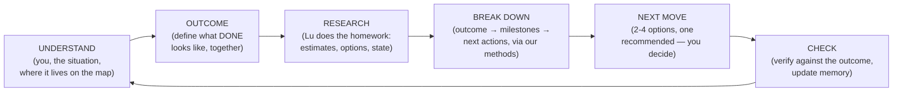

# The Roadmap — the Loop, the Map, and the first authored World

> The master document for how a person and Lu interact — from the first second, at every level of
> abstraction. This is not a product-order roadmap (features to ship). It is the **authored script of
> interaction**. We are the game designers; we author the paths. Lu executes them — adapting words and
> options to each person and company — but never inventing the path (the authored/planned boundary is
> now formal: [framework.md](./framework.md) §0). Companions:
> [framework.md](./framework.md) (the concepts) · [map.md](./map.md) (the tree, instantiated) ·
> [product.md](./product.md) (surfaces) · [system.md](./system.md) (the machine) ·
> [COMPANY.md](../COMPANY.md) (why) · [paper.md](../paper.md) (the theory this instantiates).

---

# PART I — THE LOOP (the universal primitive)

Every interaction with Lu — building a company, shipping a feature, managing your money, planning your
life — is the **same loop**. It starts before any company exists: it starts with *you*.

**Grounding.** This is not an invented sequence — it's the spine that every serious framework for
breaking down high-level goals shares. [HTN planning](https://www.sciencedirect.com/science/article/pii/S0004370215000247)
(how AI planners do it): a high-level task decomposes through a library of *authored methods* into
executable actions — the decomposition knowledge is written by domain experts, the planner navigates
it. [GTD](https://sugarokr.com/blog/okrs-vs-other-popular-goal-setting-methodologies/) (how organized
people do it): the two questions are *"what does DONE look like?"* and *"what's the very next
action?"*. [OKRs + Locke & Latham goal-setting theory](https://www.okrstool.com/blog/goal-setting-frameworks)
(how companies do it): define the outcome first, make it specific, and feed progress back constantly.
OODA and PDCA add the wrapper: observe/orient before deciding, check after acting. The common spine:
**situate → define done → figure out how → do the next concrete thing → check → repeat.** That is the
loop, and our authored scripts are HTN's "method library" — we write the decomposition knowledge; Lu
is the planner walking it.

**Step 1 — UNDERSTAND.** Lu learns who you are, what the situation is, and where it lives on the
**field map** ([map.md](./map.md) — personal, work → engineering, a whole company…). The field decides everything
downstream: which questions exist, which agents and tools apply, where documents file, which
situations she watches for. Day one this is literal — she asks. Day one hundred it's implicit — she
knows. (OODA's observe + orient.)

**Step 2 — OUTCOME.** Before any plan, define what **done** looks like — stated, agreed, written
down. "Launch the MVP in 90 days." "Ship billing." "Finances organized by March." This comes EARLY —
you don't scope details before knowing the destination. A field's scoping questions exist to serve
this step: they're the minimum needed to make the outcome definable and honest. (GTD's "what does
done look like"; the OKR objective; the paper's Goal → Outcome tier.)

**Step 3 — RESEARCH.** Lu goes and figures things out — her homework, not yours: market estimates,
comparables for pricing, reading your repo, checking what's connected and what exists. The output is
*informed options*, not vibes. This is why the interview's market-size question works the way it does:
she proposes the estimate, you adjust. (The step that separates a cofounder from a form.)

**Step 4 — BREAK DOWN.** The outcome decomposes into milestones and next actions — *through the
methods we authored* (the chapters, the scripts, the situation rules). Lu never invents the
decomposition path; she instantiates ours with the company's specifics. (HTN: authored methods,
planner navigates; goal-setting theory: proximal subgoals.)

**Step 5 — NEXT MOVE.** The smallest concrete decision, now: 2-4 tappable options, exactly one
**recommended** — she thinks, you decide. A move is an **answer** (refines scoping), a **connection**
(wires a real account), or a **work order** (becomes plan → approve → build → verify → publish).
(GTD's "next action"; OODA's decide-act.)

**Step 6 — CHECK.** The result is verified against the outcome — empirically where possible (our
verification loop) — memory and state update, and the loop re-enters UNDERSTAND. She never asks what
she can derive, and the loop tightens the longer she runs. (PDCA's check; Locke & Latham's feedback.)

## The two rings (what the research added)

Deep research across company operating systems (EOS/OKR), every business function, and personal
systems (GTD/YNAB/training) found the same structure everywhere: the loop above is actually **two
nested rings running at different speeds**:

- **The execution ring** — the six steps above, run per piece of work, fast (a build, an invoice, a
  ticket, a workout). This is where moves happen.
- **The review ring** — a slower, *scheduled* rhythm that looks at the execution ring from above:
  - the **heartbeat** (weekly, almost universally): compare plan vs. actual on a small scorecard,
    surface issues, commit the next moves. EOS runs it as the Level-10 meeting (fixed agenda:
    scorecard → priorities → issues → to-dos); OKR teams that check in weekly complete ~43% more
    objectives than monthly ones; GTD calls it the weekly review.
  - the **reset** (quarterly, universally): grade the outcomes (EOS targets ≥80% Rock completion),
    keep/kill, and set the next 90-day outcomes. This is where OUTCOME gets re-run deliberately
    rather than reactively.

Two universal primitives ride the review ring, found in every domain researched:

1. **The scorecard** — 5-15 numbers per field, checked at the heartbeat, that make the field's health
   legible at a glance. They split into *flow* metrics (lead time, response time, conversion) and
   *staleness* signals (nothing overdue, no unreviewed SOPs, no unsigned contracts).
2. **The obligations calendar** — recurring TIME-triggered duties (renewals, filings, the monthly
   close, deloads). These are situations that fire on dates, not events — a second class our
   situation system must carry.

**The rules of the loop** (hold at every level):

- **Lu speaks first.** Silence is never the state; a blank chat box is a design failure.
- **She thinks; you decide.** Every question ships her recommendation. Every gate is yours.
- **State is derived, never invented.** Her place in any script is computed from real data —
  reload-safe, unlosable.
- **Checkpoints, not noise.** Moves appear when an authored beat or situation matches. Plain questions
  get plain prose.
- **One frontier.** The current moves are the single source for chat chips, the Home next-list, and
  her proactive nudges.
- **Everything durable lands in the Library**, filed by field.
- **The loop is invisible.** No progress bars, no map screens. It manifests only as: who speaks
  first, what she asks, and which moves she offers.

---

# PART II — THE MAP → superseded (2026-07-19)

This part's formal content moved, per the critique's G1 decisions ([critique.md](./critique.md), D1/D6):

- **What a field, module, and skill ARE** — the concepts, the workspace anatomy, the UI contract:
  [framework.md](./framework.md).
- **The tree itself, instantiated** — every field's charter, modules, skills, and panels:
  [map.md](./map.md).
- The Field Book's per-domain research (loops, cadences, scorecards, sources) is absorbed into
  map.md's field entries; the original text lives in git history at this file's pre-2026-07-19
  revisions.

What Part II got right survives there: the tree as addressing, the routing and nesting rules,
activation-not-preexistence, and the fractal loop principle. What changed: the "seven authored
things" were factored into the field charter + the **module** (the new unit of capability), and
`personal/goals` became the personal world's steering module.

---

# PART III — THE FIRST AUTHORED WORLD: the company

The Business world's script — the loop instantiated. Chapters 0-4 are its **setup arc** (scope →
connect → blueprint → first ship); Chapter 5 is its **standing loop**.

## Chapter 0 — First contact

**Trigger.** Sign-up finishes, the canvas loads, and Lu's opening message is *already in the thread*.

**What happens.** One message, personalized from sign-up (name · role · idea stage · company name).
This is UNDERSTAND at its rawest — she introduces herself and invites the one thing she needs: what
you're building.

> *"Hey Levi — I'm Lu. I run this place with you. Tell me what you're building — a sentence or a wall
> of text, both work."*

**Moves.** None. The opener is free text on purpose — her message is the invitation, and what she
needs first is your unconstrained description, not a menu.

**Open:** the opener's exact voice; does she preview what comes next or stay minimal?

## Chapter 1 — Scope the company (the interview TREE)

The scoping script is a **tree, not a line** — one answer leads to a different story. A pre-idea
founder, a drowning 12-person agency, and someone who just wants a website are three different
interviews from the second question onward. The composition rule (from six research passes across
SBDC/SCORE intake, EMyth/EOS diagnostics, business brokers, fractional CFOs, YC/Mom Test/Sean Ellis,
Churchill & Lewis/Greiner, medical triage design, and Gong's 519k-call discovery data):
**intent picks the interview's content · level picks its vocabulary and depth · archetype picks the
specialist module.**

### The session contract (how the tree is walked — grounded mechanics)

- **Session 1 does exactly three jobs**: classify (wing + level + archetype), hit the fork, agree the
  first 90-day move. Everything else queues for later, asked in context. (Progressive profiling —
  never re-ask a known field.)
- **Budget: 10-15 questions, hard ceiling** (~7-8 min; completion collapses beyond it). Rhythm:
  **~3 questions → give something back** (a read-back, an insight, a draft) — Gong's 11-14-spread-
  evenly pattern, never front-loaded interrogation.
- **Derive > label > confirm > ask.** High confidence → *implicit* ("Since you're pre-revenue, let's
  talk first customers…" — correctable, costs zero budget). Medium → *explicit*, reserved for forks
  that reroute everything ("Sounds like a one-person shop — right?"). Voss-style labels ("It seems
  like cash is what keeps you up at night…") harvest more than questions. Never ask what was already
  answered.
- **One discriminator per fork · depth ≤3 · every question skippable · free chat always.**
- **Re-classification mid-conversation**: a later answer can reroute the wing — the classic case: a
  GROW request from a drowning owner is a FIX problem wearing a growth costume.
- **"I don't know" is a first-class answer** — and often becomes the first 90-day move ("then
  measuring it is where we start").

### The trunk (everyone)

- **T0 — the opener** (Chapter 0's free text). Lu DERIVES from it: new-vs-existing, intent guess,
  archetype guess, B2B/C — and confirms instead of asking.
- **T1 — the INTENT fork** (only if not obvious): *start something new · grow my business · get it
  off my back (fix/organize) · get us online (modernize) · build me something specific (project)*.
  Distress signals route to cash triage (recover); "sell it" surfaces inside the goal fork below.
- **T2 — general discriminators** (existing businesses; worst-case-first, triage-style — the first
  red flag STOPS classification and routes):
  1. **The payroll screen**: "Can you comfortably make payroll and next month's bills?" A no ends
     the interview's niceties — cash triage now (⭐ the 13-week rolling cash forecast), regardless
     of everything else.
  2. **The SBDC basics** (3 chips): years running · headcount · **3-year trend** — growing / flat /
     declining. The trend sets the MODE: struggling → cash first; stuck → owner-time and process;
     growing → team and systems.
  3. **Owner-dependence** (the broker probes, verbatim, any business): last two consecutive weeks
     off? who signs off pricing? who do top customers call when something breaks?
  4. **Re-routers**: funded? franchise? (Forced-evolution businesses skip stages — Stage-IV systems
     bolted on a Stage-I company — and get different questions.)

### Wing A — START (the new-venture ladder)

**Discriminator:** "What exists today?" → nothing · talked to people · building · live, few users ·
first customers · revenue. Each stage's module triangulates its ONE dominant risk, and lists what NOT
to ask yet:

| Stage | Dominant risk | Module asks (2-3) | Never asks yet |
|---|---|---|---|
| pre-idea | a manufactured "sitcom" idea | what are you at the leading edge of? last time you saw someone hit this problem? | model, market size, name |
| idea | no real need (83% of "I'd use this" never act) | riskiest assumption + how to test it in days? who's committed something real? | stack, features, hiring |
| building | never shipping | the 90/10 version? what date does a first user touch it? what are you NOT building? | scaling, pricing optimization |
| live, few users | leaky funnel (30-40% typical activation) | where do the next 10 users come from? talked to every signup? | CAC/LTV precision, paid scaling |
| customers | false PMF | who'd be *very disappointed* if this vanished? what do the most-engaged share? | org design, metrics theater |
| revenue | broken unit economics under growth | what's working — and what if you doubled it? CAC/payback/churn? | zero-to-one validation (settled) |

Then the **archetype module, light** (2-3 defining questions from the description): SaaS →
wedge/ICP · services → niche + owner capacity · marketplace → which side first · DTC → contribution
margin math · creator → owned audience · local → the booking path. B2B/C resolved by *"who pays, and
how big is one deal?"* (deal size, not customer type, picks the sub-branch). Market size appears
ONLY here, as a RESEARCH move: *she* proposes the estimate, you adjust.

**Wing A outcome menu** — *prove ONE constrained thing*: the stage's canonical outcome ⭐ plus the two
adjacent stages' options (people misclassify their own stage): e.g. idea-stage → test the riskiest
assumption with real commitments ⭐ · build the 90/10 and hand-recruit 10 users · 20 more problem
interviews first.

### Wing B — EXISTING (any business, any archetype — the invariant sequence)

1. **The compounding ratio** — the archetype's first diagnostic number, asked in plain words:

| Archetype | The one number | Why it's first |
|---|---|---|
| SaaS | **NRR, decomposed** (expansion % − churn %) | 103% from 8−5 is a churn problem wearing a growth costume |
| services/agency | **AGI per FTE** ($160K = respectability) | contains rate, utilization, scope discipline in one number |
| marketplace | **fill rate** | low fill = a directory, not a marketplace |
| e-commerce/DTC | **contribution margin per order, after marketing** | repeat × margin is what pays back CAC |
| content/creator | **% revenue from the largest platform/stream** | an algorithm change can cut earnings 30-50% overnight |
| local | **prebook/rebook rate** (prebooked retains ~70% vs ~30%) | exposes the retention system and predictability at once |

2. **Decompose it** (one follow-up: expansion vs churn · blended vs new-customer · walk-in vs
   prebooked). The most common finding is an **unmeasured leak**: pricing untouched for years (~30%
   left on the table), over-servicing (37-52% of projects), unprofitable first orders under blended
   metrics, the owner as best-producer-not-owner.
3. **The calcified dependency** — T2's owner-dependence answers, now specialized by archetype
   (key-developer, client relationships, the founder's face, the platform).
4. **THE GOAL FORK** (Churchill & Lewis Stage III — the most important question at this level):
   **"Bigger, better/calmer, or ready to sell?"** — and *better/calmer is a fully valid answer*.
   Detect it through consequences, not preference (resistance shows as fear): "if you doubled
   headcount, what would that do to your day? your control?" · "should the business pay you well, or
   be worth a lot?" · the exit tell: "what would you do the day after?"
5. **Wing B outcome menu** — composed from archetype × goal (grow / fix / systematize / modernize)
   and the C&L level menus, e.g.: Survival-level → ⭐ the 13-week cash forecast + break-even/pricing
   fix; Success-Disengage → ⭐ the owner-independence sprint (SOPs, a real second, owner-free weeks);
   Success-Growth → ⭐ hire one manager for the future + one system ahead of need; Take-off → ⭐
   quarterly focus discipline (3-5 priorities, ONE main thing) + true-delegation upgrade. Established
   SaaS + modernize → *run the first pricing test in years*; salon + fix → price raise + the checkout
   rebooking script. **The lagging-factor rule**: when factors sit at different stages (III-G cash,
   Stage-I supervision), the recommended Rock targets the LAGGING factor — that business gets the
   delegation Rock, not the growth Rock.

### Wing C — PROJECT ("build me X")

Deliberately short — interrogating the whole business here is a bait-and-switch. Four beats: what
problem does X solve (the one validation pass — the stated deliverable is sometimes the wrong fix) ·
who's it for · what does done look like · what's out of scope. Then straight into the plan gate. The
full scoping is *offered*, never forced, and happens progressively afterward.

### The catch-all

When nothing fits (triage keeps an "unwell adult" chart; so do we): the SBDC generic opener + a walk
of the eight universal dimensions — money · customer quality · getting customers · delivering · team ·
owner · direction · trend — at mode-appropriate depth.

### Convergence (every wing)

The agreed 90-day outcome (the loop's OUTCOME step — never a generic "what's your goal": always the
wing-and-archetype-specific menu) → the **decision batch** (3-5 framing decisions, only for genuinely
open calls — cards with a recommended option; tapping an option IS the decision, "Other" answers it
free-text) → **the Business Context doc**, filed
Library → General, the context every downstream agent reads. Its sections FLEX by wing:

- **New venture:** Company Name · Product · ICP (+ JTBD) · Mission · Classification · Values ·
  One-Sentence Summary · Business Model · Pricing · GTM · Unfair Advantage · Stage · Market Size ·
  Team · the 90-Day Outcome.
- **Existing business:** the diagnostic snapshot — what it is · years/headcount · 3-year trend +
  mode · the compounding ratio (or "unmeasured — our first move") · the dependency read · C&L level ·
  the goal (bigger / calmer / sell) · the 90-Day Outcome.

Unfilled sections stay honestly empty and fill progressively. At the bottom: **Accept & activate
departments** — accepting boots the company and closes scoping.

**Open:** do answers accumulate into a visible growing draft during the interview, or only the final
doc? Wing-B archetype modules beyond the six (nonprofits? restaurants-as-distinct-from-local?).

## Chapter 2 — Connect the rails

The world needs its real accounts. Lu drives — never a settings page; each beat fires the connect card
in the chat.

1. **Connect GitHub** (App install) → 2. **Connect Vercel** (Integration) → 3. **Import your repo**
(*only if the interview surfaced an existing repo/product* — the Projects picker, setup/test
commands) → 4. **Supabase**
(*only if the product needs data*; she asks if unclear).

**Open:** import before or after the connects? Her wording for skippable vs required.

## Chapter 3 — Architecture

The BREAK DOWN step made visible: she drafts the **Architecture doc** from the Business Context (+ the
imported repo) — what gets built first, the stack, main components, out of scope. Card in chat; files
Library → Engineering.

**Moves:** approve *(rec)* · ask for changes (she re-drafts) · walk me through it. No build starts
while the blueprint is unapproved.

**Open:** v1 depth — a paragraph or a real component breakdown?

## Chapter 4 — First ship

She proposes **one small build** derived from the 90-day outcome — a landing page, one core screen,
one working flow. Never the whole product.

**The loop:** propose (moves: *build it (rec) · adjust the scope · something else first*) → plan gate →
sandbox build → verify → publish gate → **live**. First publish = the setup arc is complete: scoped,
connected, blueprinted, shipped.

**Open:** she picks the first build vs offers 2-3 candidates?

## Chapter 5 — Running the company (the standing loop)

The CHECK step, running forever: every situation below is a moment where reality changed and the loop
re-enters. No more fixed sequence — **authored situations**. When one matches, her turn ends with its
moves; when none does, plain prose. ("Forever vs checkpoints": checkpoints, and we define them.)

| Situation | Moves (one recommended) |
|---|---|
| A build went **live** | next feature toward the outcome *(rec)* · improve copy/design · request changes · how's traffic? |
| **Preview ready** | review + publish *(rec)* · request changes · show me the diff |
| **Verify / build failed** | let me rework it *(rec)* · re-plan it · show me what failed |
| A **plan waits** and you've gone quiet | approve it *(rec)* · request changes · walk me through it |
| You **return after idle**, nothing open | status recap + the outcome's next step *(rec)* · review the Library · start something new |
| An **unanswered question** | its own options, re-surfaced |
| A **migration is staged** | review the SQL *(rec)* · reject it |

**The weekly review (time-triggered — answered by research: yes, it exists, and it's THE beat).**
Every operating system studied has a weekly heartbeat; ours is Lu opening it, on schedule, with the
Level-10-derived agenda: **scorecard** (the company's numbers, flow + staleness) → **outcome
progress** (the 90-day outcome, honestly graded) → **issues** (what's stuck or failed, each with a
proposed resolution) → **commitments** (the moves for the week, one recommended set). Fifteen minutes
of reading, a handful of taps. Later, the quarterly reset rides the same rail: grade the outcome
(≥80% bar), keep/kill, set the next one — re-running the interview's OUTCOME step deliberately.

**Time-triggered situations** (the obligations calendar — the second class): the weekly review ·
(later, per the Field Book) the monthly close · renewal dates 90 days out · compliance filings ·
channel-verdict dates. Same mechanics as event situations; the trigger is a date, not a webhook.

**Open (the big one):** the full event-situation set; which ship first; metric-triggered situations
(first signup, traffic threshold, first payment). This table is where "running the company as a game"
lives or dies.

---

# HOW IT MANIFESTS

No roadmap screen, no progress bar. Three behaviors only:

- **Lu speaks first** — the thread is never empty.
- **She asks the authored questions** — the scoping scripts, the connects, the gates.
- **Her turns end with moves** — ONE question card living *on the message* (persisted, reload-safe):
  the question + tappable option rows, one recommended, plus an automatic "Other" (free text). The
  same frontier feeds Home's next-list and her proactive nudges.

---

# OPEN QUESTIONS (the agenda)

1. **The Loop** — does OUTCOME deserve its own visible artifact per field (a standing goal doc Lu
   re-anchors to), or does it live inside the field's context doc (as in Business: the 90-day goal)?
   The research leans standing: every system keeps the plan artifact separate from the context.
   *(Partially answered 2026-07-19: the current outcome is a steering-module record —
   framework.md §1; whether it renders as its own doc stays open.)*
2. **The Map** — *answered 2026-07-19*: shape decided at critique.md G1 (module-first, full
   instantiation); Studio/Dev authored in map.md; remaining map questions live in map.md itself.
3. **The interview tree** — growing-draft vs final-doc-only during the interview; where the
   scorecard question ("which 5-15 numbers prove it's working") lands — in scoping or as Lu's first
   RESEARCH proposal; archetype modules beyond the six.
4. **Chapter 5** — the event-situation set and order; metric-triggered situations.
5. **Voice** — the opener, the game-ness of tone, when she recaps.
6. **Parked** — Lu extending the map / adding roadmap steps herself.

*Resolved by research (2026-07-18): the weekly-review beat exists and has its agenda (L10-derived);
the loop is two rings (execution + review); situations have two classes (event + time); every field's
seven things were grounded in the Field Book (both since factored into charters + modules — see
framework.md/map.md); cadences per field come from how each function really operates. Second pass (six reports, same day): Chapter 1 became a TREE — intent is the first fork
(start · grow · fix · modernize · project), the payroll screen precedes everything on existing paths,
Churchill & Lewis levels + the archetype ratios drive Wing B, the goal fork (bigger/calmer/sell) is
detected through consequences, outcome menus are wing-and-archetype-specific (generic "90-day goal"
question eliminated), TAM moved to Wing A only, and the session contract (10-15 question budget,
derive>label>confirm>ask, progressive profiling) is grounded in Gong/SurveyMonkey/triage design.*
