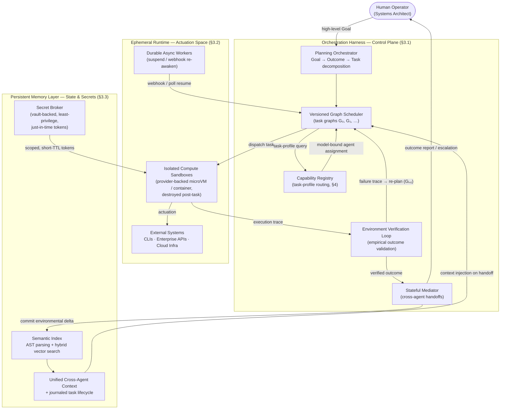
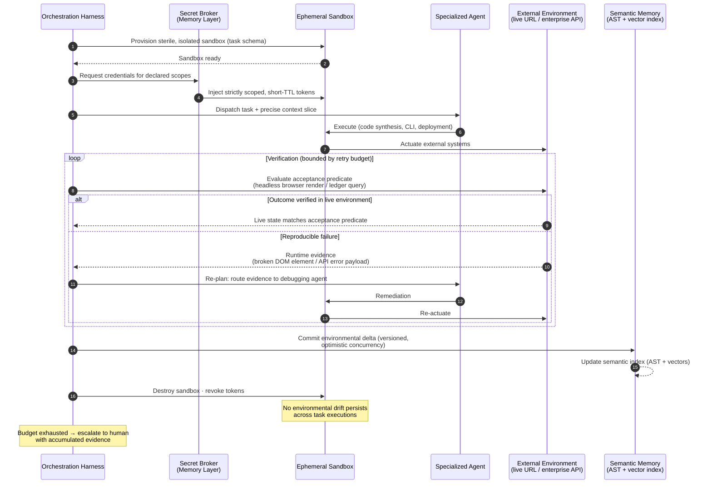
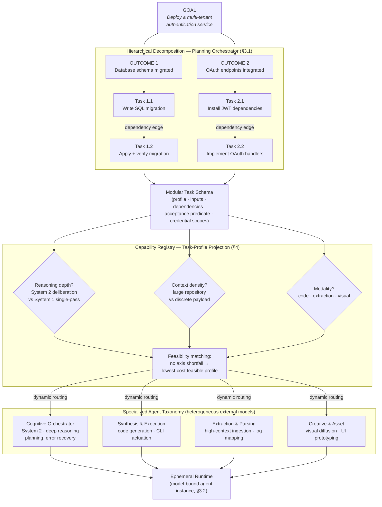
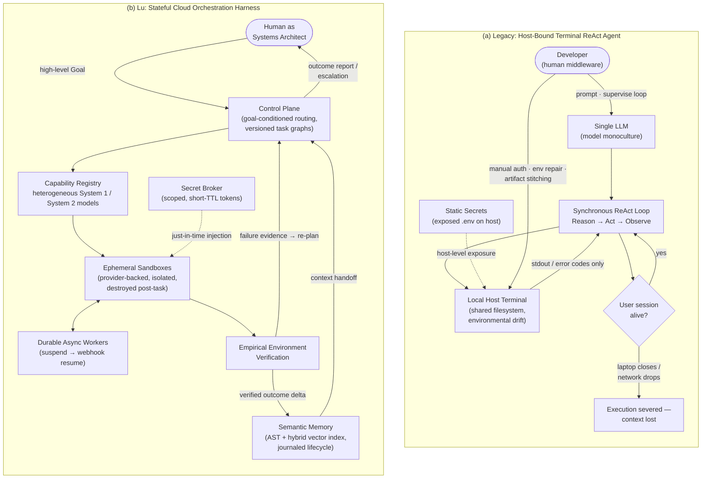

# Lu: Architecting Persistent Multi-Agent Systems for High-Level Goal Execution

## Abstract

The frontier of applied artificial intelligence is shifting from generating localized outputs to independently achieving complex, high-level goals. Pursuing goals at this level requires Multi-Agent Systems (MAS): specialized agents that collaborate under a central orchestrator, combining persistent memory, goal-directed planning, and automated validation with the ability to act on real systems. Agentic Software Engineering (ASE) — terminal-integrated agents such as Claude Code and Cursor — has proven that this blueprint works for isolated workflows, but its potential remains trapped: current architectures are bound to synchronous, single-model sessions on a local host, where the human operator serves as the system's middleware — injecting credentials, repairing environments, stitching artifacts, and supervising the loop. We argue this ceiling is an infrastructure problem, not a model-capability problem, and that it applies to any goal domain, not only engineering. We present **Lu**, a stateful, cloud-native orchestration harness for persistent multi-agent goal execution. Lu is deliberately a *harness*, not a portfolio of novel subsystems: it composes proven substrate classes — microVM-grade sandboxing, durable workflow journaling, dynamic-secrets infrastructure, and heterogeneous commercial model APIs — behind provider-agnostic interfaces, and contributes the stateful control layer that binds them into a goal-directed whole. Specifically, Lu contributes: (i) a control plane that decomposes high-level goals into verifiable outcomes and granular tasks, executed as *versioned* task graphs with closed-loop re-planning; (ii) a runtime that pairs disposable, isolated sandboxes with durable, journaled workflow state, so containers may die while executions survive; (iii) a persistent memory layer that maintains a semantic, queryable representation of system state across agents and provisions least-privilege, just-in-time credentials under an explicit threat model; and (iv) a capability registry that routes each task to the model class best matched to its reasoning depth, context density, and modality. We trace an end-to-end scenario through the architecture and discuss its failure semantics, residual risks, and open problems. We argue this design shifts the human role from terminal supervisor to systems architect.

## 1. Introduction

The integration of Large Language Models (LLMs) with local computing environments has advanced artificial intelligence from passive text synthesis to active task execution. Driven by the fusion of LLMs with the Command Line Interface (CLI), tools such as Claude Code [18], Cursor, and OpenHands [19] have operationalized Terminal-Integrated ReAct (Reasoning and Acting) loops [1]. These agents are effective at producing isolated artifacts — generating frontend components, defining database schemas, or executing targeted automation scripts — and their progress is measurable on benchmarks such as SWE-bench [15]. They have transformed the AI from an oracle that suggests code into a localized task runner that writes and executes it.

However, generating a localized output is not equivalent to achieving a goal. In production settings the objective is rarely a raw output (a block of code, a drafted email, a generated report); the objective is an **outcome** — a realized, real-world state change: a multi-tenant feature shipped to users, a month of transactions reconciled against a ledger, a campaign launched whose pages, assets, and tracking verifiably work. We compress this distinction into the paper's central framing: today's agents are *AI that codes*; the next paradigm requires *AI that operates*. Software engineering is where the agentic blueprint is most mature — which is why it supplies this paper's running examples — but the ceiling we describe, and the infrastructure required to cross it, are domain-general.

Current systems hit that ceiling because they conflate localized output generation with operational autonomy. Designed as host-bound execution agents operating within ephemeral, single-model terminal sessions, they lack the environment and orchestration harness necessary to pursue higher-level goals. Consequently, the human is forced to act as the system's middleware — manually stitching isolated artifacts together, injecting external credentials, resolving environment conflicts, and supervising the terminal so the execution loop does not stall.

We contend that this ceiling is not primarily a limitation of model capability but of **infrastructure**. To move from supervised, host-bound task runners toward durable, multi-model *Continuous Autonomous Operators* — self-directed systems that persistently execute, evaluate, and refine work against high-level goals — execution must be decoupled from the local machine. This requires replacing the localized CLI session with a centralized, cloud-native orchestration harness that provides persistent memory, secure machine identity, and coordinated execution across a heterogeneous Multi-Agent System (MAS).

**Positioning: a harness, not a platform of novel subsystems.** A deliberate design decision shapes everything that follows: Lu does not reimplement its substrates. Every ingredient it depends on already exists in hardened, production form — microVM sandboxing [8, 9], durable workflow execution [7], dynamic secrets and workload identity [10, 11], and a growing market of heterogeneous model APIs [17]. Lu wraps these behind provider-agnostic interfaces and contributes the layer that none of them provide individually: the stateful harness — the schemas, control loop, state model, and routing procedure — that binds disconnected substrates into a persistent, goal-directed system. The research contribution is the *composition*, and we argue the composition is where the unsolved problem lives (§2).

In this paper we introduce **Lu**, a stateful orchestration harness designed to bridge the gap between isolated output generation and autonomous outcome realization. This is an architecture paper: our contributions are a design and its rationale, together with an end-to-end trace and an explicit account of failure semantics and residual risks. We make the following contributions:

- **A stateful cloud control plane** (§3.1) that decomposes goals into verifiable outcomes and granular tasks, schedules them as versioned task graphs, and closes the loop with empirical environment verification and re-planning.
- **An ephemeral-compute, durable-workflow runtime** (§3.2), composed from sandboxing and journaled-execution substrates, that isolates untrusted execution in disposable environments while workflow state survives disconnects, suspensions, and multi-day horizons.
- **A persistent memory layer** (§3.3) that maintains semantic cross-agent context via AST-aware indexing and brokers least-privilege, just-in-time credentials from vault-class infrastructure — with an explicit statement of the residual threat model.
- **A capability registry and routing procedure** (§4) that assigns each task to the external model class best matched to its reasoning depth (operationally defined System 1 vs. System 2 profiles), context density, and modality.

The remainder of the paper situates Lu against prior work (§2), details the architecture (§3–4), contrasts it with host-bound frameworks (§5), traces a worked scenario end-to-end (§6), and states limitations and future work (§7).

## 2. Background and Related Work

Lu composes five ingredients that exist, in isolation, across several research and industrial lineages. We review each, note what Lu adopts from it, and identify the gap Lu targets.

**Terminal-integrated coding agents.** The ReAct pattern [1] and chain-of-thought prompting [2] established that LLMs can interleave deliberation with tool use. Products such as Claude Code [18] and Cursor, and open platforms such as OpenHands [19], embed this loop in a developer's terminal or editor, and self-reflective variants such as Reflexion [16] improve single-agent recovery. These systems define the current state of the art in ASE, but they inherit the host's constraints: a synchronous session, a single model, host-level secrets, and a filesystem shared with the operator.

**Multi-agent frameworks.** AutoGen [4], MetaGPT [5], CrewAI, and LangGraph [6] provide programming abstractions for multi-agent conversation and graph-structured agent workflows. They address *coordination logic* but are largely substrate-agnostic: execution isolation, durable state, credential management, and empirical verification are left to the embedding application. Lu treats exactly these substrate concerns as the first-class problem.

**Durable workflow execution.** Workflow engines such as Temporal [7] pioneered durable execution: workflow state is event-sourced to a journal so that logical executions survive process and machine failure, with at-least-once task dispatch made safe by idempotent activities. Lu adopts this execution model as consumed infrastructure (§3.2) and adds a cognitive layer above it — plans are generated and revised by models rather than hardcoded as static workflow definitions.

**Sandboxed and serverless compute.** MicroVM and user-space-kernel isolation substrates — Firecracker [8], gVisor [9] — demonstrate that strong isolation is compatible with sub-second provisioning at scale, and a growing ecosystem of hosted sandbox services exposes exactly this capability as an API. Lu consumes this substrate class through a provider interface (§3.2) rather than operating its own virtualization stack.

**Secrets and workload identity.** HashiCorp Vault [10] established dynamic secrets — short-lived, narrowly scoped credentials generated on demand — and SPIFFE/SPIRE [11] established attestation-based workload identity. Lu specifies the issuance contract for agent workloads and delegates the cryptographic machinery to this substrate class (§3.3).

**Model routing and cascades.** FrugalGPT [12], RouteLLM [13], and HuggingGPT [14] show that routing queries across a portfolio of heterogeneous models can reduce cost at comparable quality and extend a system's modality coverage. Separately, inference-time-compute reasoning models [17] have made *deliberation depth* an explicit, selectable model property. Lu's capability registry (§4) operationalizes both results for task-level routing over external model APIs inside an execution harness.

**The gap.** No existing system composes these ingredients into a single operational substrate: multi-agent frameworks lack durable execution and secure actuation; workflow engines lack cognitive planning; coding agents lack all of the above beyond a single host session. Lu deliberately implements none of the five ingredients from scratch. Its contribution is the composition — an orchestration harness in which planning, isolated actuation, durable state, machine identity, and heterogeneous routing are co-designed around a shared task schema and a journaled state model.

## 3. System Architecture

The Lu architecture departs from the linear, local ReAct loop in favor of a distributed control plane coordinating three interdependent subsystems: the **Orchestration Harness** (control), the **Ephemeral Runtime** (actuation), and the **Persistent Memory Layer** (state and secrets). Every task in the system advances through an explicit lifecycle — `PLANNED → DISPATCHED → EXECUTING → VERIFYING → {COMMITTED | FAILED}` — and every lifecycle transition is journaled to the memory layer, which is what makes the system stateful in a precise sense: the authoritative execution state lives in the journal, not in any process, container, or terminal session.

**Design principle: composition over reimplementation.** Each subsystem below is specified as a contract over an existing substrate class, consumed through a provider interface. Any sandbox service exposing *provision/execute/destroy* with attested identity can back the runtime; any vault-class system exposing scoped, short-TTL credential minting can back the secrets layer; any journaling substrate with event-sourced replay can back durability. What is Lu's own — and what this section therefore specifies — is the connective tissue: the task schema, the lifecycle and its journal, the verification loop, and the handoff protocol. Figure 1 gives the overview.

**Figure 1: Lu system architecture.** The control plane decomposes goals and routes tasks; the ephemeral runtime executes them in disposable sandboxes with just-in-time credentials; the memory layer persists semantic state and journaled lifecycle transitions across agents. Sandbox provisioning, credential minting, and journaling are delegated to substrate providers; the harness contributes the contracts and control flow between them.

### 3.1 The Orchestration Harness (The Control Plane)

At the core of the architecture is the Orchestration Harness, a centralized control plane responsible for agent lifecycle management, cognitive routing, and inter-process communication. Unlike static pipeline tools or workflow automations that rely on hardcoded, deterministic node-wiring, the Harness functions as a goal-conditioned routing layer whose plans are generated — and revised — by models at runtime.

**Hierarchical decomposition.** When initialized with a high-level **Goal** (e.g., "Deploy a multi-tenant authentication service"), the Harness does not immediately attempt execution. A planning orchestrator translates the Goal into a set of verifiable **Outcomes** (e.g., "Database schema migrated," "OAuth endpoints integrated"), each of which is distilled into granular, executable **Tasks** (e.g., "Write SQL migration," "Install JWT dependencies"). Every task is expressed as a **task schema** — a structured record containing:

- a unique identifier and an *idempotency key* (§3.2);
- a reference to the parent Outcome and its **acceptance predicate** — the empirical condition under which the Outcome counts as achieved;
- a **capability profile** along three axes: reasoning depth, context density, and modality (§4);
- declared inputs, dependency edges, and the minimal **credential scopes** the task requires (§3.3).

The schema is the contract between planning and execution — and the primary interface Lu adds above its substrates: routing (§4), credential issuance (§3.3), and verification all read from it. Nothing in the schema is engineering-specific; an accounts-reconciliation task carries ledger scopes and a ledger-state acceptance predicate exactly as a deployment task carries repository scopes and a live-URL predicate.

**Versioned graph execution.** The Harness compiles the task set into a Directed Acyclic Graph (DAG) whose edges are the declared dependencies, and schedules ready nodes concurrently. Rather than relying on a single monolithic model to process the graph, the control plane evaluates each node's capability profile and routes it to a specialized agent (e.g., schema design to a Database Architect agent; component generation to a Frontend Synthesis agent). A subtlety deserves emphasis: self-correction does *not* introduce cycles into the executed graph. When verification fails (below), the Harness does not traverse a back-edge; it triggers **re-planning**, which emits a new graph version *G(i+1)* containing the remediation tasks. Each executed graph remains acyclic; iteration lives in the control plane as a sequence of graph versions, each journaled with the failure evidence that motivated it.

**Stateful handoffs.** As specialized agents complete tasks, the Harness acts as the stateful mediator. When Agent A (e.g., the Architect) completes a structural task, the Harness captures the output artifact, commits the delta to the memory layer, and triggers Agent B (e.g., the Coder) with the precise context slice required to proceed — retrieved from the semantic index rather than replayed as raw transcript (§3.3).

**Environment verification loop.** Before any Outcome transitions to `COMMITTED`, the control plane evaluates its acceptance predicate *empirically*, in the live environment, rather than relying solely on code-level assertions such as unit tests or linter passes. Following a user-interface deployment, for instance, a verification agent spins up a headless browser, navigates to the live URL, and evaluates the rendered state; for a financial or operational workflow, the system queries the external destination state directly, such as a transaction ledger or an API account balance. If the predicate fails, the Harness captures the runtime evidence — a broken DOM element, an API error payload — and routes it to a debugging agent via re-planning, as above.

Because empirical checks against live environments are inherently noisy (headless-browser assertions in particular are a well-known source of nondeterminism), the loop is governed by an explicit policy rather than unbounded retry: each acceptance predicate carries a **retry budget**; verification failures are only treated as *task* failures if they reproduce across independent check executions (distinguishing flakes from faults); and exhaustion of the budget escalates to the human operator with the accumulated evidence attached. Human oversight is thus not eliminated — it is *relocated*, from continuous supervision of the inner loop to defined escalation and approval boundaries.

### 3.2 The Ephemeral Runtime (The Actuation Space)

To translate plans into system state changes, Lu requires a secure actuation space. Where legacy agentic frameworks bind execution to the developer's local shell, Lu implements a dedicated runtime — a cloud-native compute layer for isolated, asynchronous task execution, assembled from provider-backed substrates.

A naming tension deserves immediate resolution: the runtime is **ephemeral at the compute layer and durable at the workflow layer**. Individual sandboxes are disposable and short-lived; the logical execution that spans them is long-lived, because every lifecycle transition is journaled to the memory layer (§3.3). A container may die at any point without the execution losing progress. The two properties are complementary, not contradictory.

**Isolated compute sandboxing.** The runtime replaces the local host terminal with ephemeral, isolated micro-environments in the mold of microVM and user-space-kernel substrates [8, 9], consumed through a sandbox-provider interface: any service exposing *provision/execute/destroy* with attested workload identity qualifies, and Lu operates no virtualization stack of its own. When an orchestrator routes a task requiring code execution, CLI interaction, or compilation, the runtime provisions a sterile sandbox on demand. Isolation confines arbitrary code execution — whether synthesized by an LLM or fetched from third-party dependencies — so it cannot contaminate other workloads, leak across agent boundaries, or escalate privilege; sandbox egress is restricted to the endpoints implied by the task's credential scopes. Once the task's execution trace and verification conclude, the sandbox is destroyed. This prevents the accumulation of *environmental drift* — a common failure mode of local ReAct loops, in which leftover files and conflicting dependencies degrade the agent's environment over time.

**Durable asynchronous workers.** A critical limitation of host-bound execution is its coupling to a synchronous user session: if the user closes their laptop or the network drops, the execution loop is severed. Lu's workers — built on the durable-execution model pioneered by workflow engines [7] — are decoupled from any user session. An agent can trigger a lengthy operation — compiling a large codebase, deploying infrastructure via Terraform, awaiting a third-party approval — and enter a suspended state; the runtime listens for webhooks or polls for state changes, re-awakening the agent with its full journaled context once the external operation resolves. This transforms the agent from a synchronous prompt-response script into a persistent background operator capable of managing workflows that span hours or days.

**Failure semantics.** Task dispatch is **at-least-once**: a worker or sandbox may fail after performing an action but before acknowledging it, and the Harness will re-dispatch. Safety under redelivery follows the durable-execution playbook [7]: every task schema carries an idempotency key, and effectful operations against external systems are keyed on it, so re-executions converge rather than duplicate. Tasks whose external effects cannot be made idempotent (e.g., a non-idempotent third-party API) are marked as such in the schema and are dispatched under stricter, exactly-once-style fencing — at the cost of throughput — or gated behind an escalation boundary.

### 3.3 The Persistent Memory Layer (Perception, State, and Secrets)

The transition from localized task execution to continuous operation introduces a central challenge: state degradation. Because execution sandboxes are ephemeral and orchestrators are distributed, the system requires a decoupled, centralized layer for perception and state. In Lu, the memory layer is the *sole* owner of perception: it is the one place where the evolving state of the world — code, infrastructure, ledgers, execution history — is represented, indexed, and made queryable to every agent. (Sandboxes observe; the memory layer *remembers*.) The same layer brokers machine identity.

**Unified cross-agent context and semantic indexing.** When an ephemeral sandbox is destroyed, the environmental delta — what was built, modified, or verified — is committed to the memory layer. Lu does not merely store raw files: to ensure heterogeneous agents can interpret the evolving environment, the layer maintains a semantic index combining Abstract Syntax Tree (AST) parsing with hybrid vector search, yielding a queryable representation of project state. This enables clean operational handoffs: when a Backend Architect agent restructures a database schema, the index is updated, and the Frontend Synthesis agent queries the updated architectural context rather than parsing raw changelogs. Agents can therefore be spun down, suspended, and resumed without context-window degradation or reliance on stale recollections of past states.

**Concurrency control.** A shared semantic index invites a classic distributed-systems hazard: concurrent writers. Two agents completing tasks in parallel may commit conflicting environmental deltas (e.g., both modifying the same schema definition). Lu handles this with versioned deltas under optimistic concurrency: each commit declares the index version it was computed against; a commit against a stale version is rejected, and the rejection is surfaced to the Harness as a re-planning trigger — the conflicting task is re-executed against the updated context. Conflicts are thereby resolved by the planning layer, which can reason about intent, rather than by blind last-writer-wins merging.

**Just-in-time, least-privilege credentials.** Equally critical is secure machine identity. Legacy local agents rely on the host's exposed `.env` files, or force the human operator to authenticate OAuth flows by hand — a security liability and a break in the execution loop. Lu removes the human from the routine authentication cycle by *brokering* dynamic secrets from vault-class infrastructure [10] under attestation-based workload identity [11]; the cryptographic machinery is the substrate's, while Lu contributes the issuance contract that ties credentials to task schemas. The credential store is *logically* isolated from both the reasoning models and the global context state (it is not readable through any agent-facing query interface). When the Harness dispatches a task whose schema declares external actuation — pushing a commit, triggering a deployment, initiating a payment run — the broker mints strictly scoped, short-TTL tokens and injects them into the specific sandbox assigned to that task; on task completion the sandbox is destroyed and the tokens are revoked.

**Threat model and residual risk.** We state plainly what this design does and does not achieve. It *removes* host-credential exposure: no root or long-lived secret is ever present in an agent-reachable environment. It *narrows* the blast radius of a compromised or manipulated agent to the scopes and lifetime of the tokens for its current task, with egress policy and audit logging bounding and recording what those tokens can touch. It does **not** eliminate the risk that a token, while valid inside the sandbox, is misused by the LLM-driven process itself — for example, under an indirect prompt-injection attack in which hostile content ingested during the task steers the agent's actions [20]. Scoping, short TTLs, egress restriction, and anomaly-triggered escalation mitigate this residual channel; eliminating it is an open problem we return to in §7.

Figure 2 sequences the full task lifecycle across all three subsystems.

**Figure 2: The secure execution and verification loop.** One task's lifecycle: sandbox provisioning, just-in-time credential injection, execution, empirical verification with bounded remediation, state commit, and teardown.

## 4. Heterogeneous Multi-Model Orchestration

A structural constraint of host-bound local ReAct loops is their reliance on model monoculture. Local agents are typically hard-wired to a single LLM that must handle every phase of execution, from architectural reasoning to trivial text formatting. This produces compute asymmetry in both directions: allocating an expensive deliberative model to a basic parsing task wastes resources, while allocating a lightweight synthesis model to long-horizon planning invites logic failures. Single-model systems are also constrained in modality, unable to interleave code synthesis with, for example, visual asset generation.

Lu instead treats intelligence as a pluggable, distributed resource, building on results in model routing and cascading [12, 13, 14]. Consistent with the harness positioning, Lu trains no models and hosts none: the **Capability Registry** is a routing layer over external model APIs, and its profiles are configuration, not learned weights. The control plane consults the registry to allocate compute, so that each node in the execution graph is handled by an agent whose underlying model matches the task's profile.

**Operational definitions.** We borrow the System 1 / System 2 vocabulary from dual-process theory [3], but use it operationally, as a property of model classes rather than a cognitive claim. A **System 2 profile** denotes a model class that allocates additional inference-time compute to explicit deliberation before answering — the reasoning-model class [17] — and is warranted for tasks such as architectural roadmapping, dependency mapping, and error diagnosis. A **System 1 profile** denotes standard single-pass generation, sufficient for rapid execution tasks such as syntax generation or CLI command construction. The registry records, for each available model, a declared capability vector over these and the remaining axes below, alongside its cost characteristics.

**Task-profile projection.** When the planner emits task schemas (§3.1), the Harness projects each schema onto three axes:

1. **Reasoning depth (System 1 vs. System 2):** does the task require deliberative, inference-time-compute reasoning, or is single-pass generation sufficient?
2. **Context density:** what volume of semantic payload must be held — parsing a large repository versus evaluating a discrete JSON response?
3. **Modality:** does the task require structural code synthesis, high-volume extraction, or visual generation?

**Routing procedure.** Routing is deliberately simple — a matching step, not a learned policy (learned routing is future work, §7). For each task: (1) project the schema onto the three axes; (2) mark a registered model profile *feasible* if it meets or exceeds the task's requirement on every axis — i.e., it exhibits no *shortfall* on any axis; (3) among feasible profiles, select the lowest-cost one; (4) if no profile is feasible, return the task to the planner for decomposition into smaller tasks, or escalate. The Harness then provisions an ephemeral agent bound to the selected model.

Figure 3 illustrates decomposition and routing end-to-end; Table 1 summarizes the resulting agent taxonomy.

**Figure 3: Cognitive decomposition and routing.** A goal is decomposed into outcomes and tasks (§3.1); each task schema is projected onto the registry's capability axes and routed to a specialized, model-bound agent.

**Table 1: Lu's specialized agent taxonomy.**

| **Agent Classification** | **Core Capabilities & Modality** | **Routing Trigger (Task Profile)** |
| --- | --- | --- |
| **Cognitive Orchestrators** | Deep reasoning & goal decomposition | High-complexity architectural planning, dependency mapping, and error recovery. |
| **Synthesis & Execution** | Syntactic generation & CLI actuation | Backend code synthesis, structural refactoring, and direct terminal manipulation. |
| **Extraction & Parsing** | High-context processing & mapping | Ingesting large repositories, parsing unstructured logs, and mapping schema states. |
| **Creative & Asset** | Visual diffusion & UI prototyping | Generating frontend graphical assets, wireframe translation, and visual state verification. |

**Cross-modal artifact synchronization.** The value of task-aware heterogeneity lies in the Harness's ability to synchronize artifacts across modalities. If a goal requires deploying a new user interface, the planner decomposes the work into parallel tracks: visual requirements route to a Creative & Asset agent (backed by a diffusion model) to generate background images and icon sets, while structural requirements route to a Synthesis agent (backed by a coding-optimized LLM) to write the React components. The Harness acts as the state bridge — it captures the binary artifacts from the Creative agent, commits them to the persistent project store, and injects them into the Synthesis agent's ephemeral runtime. By formalizing the routing step and standardizing the interface between heterogeneous models and the execution environment, Lu removes the monoculture bottleneck without paying deliberative-model prices for reflexive work.

## 5. Comparison to Existing Architectures

The current state of the art in agentic execution relies predominantly on terminal-integrated ReAct agents (§2). While these systems represent a substantial leap in code synthesis, they are structurally constrained by their reliance on local host environments. Table 2 contrasts the operational dimensions of host-bound execution against Lu's stateful cloud orchestration, and Figure 4 contrasts the two topologies.

**Table 2: Architectural comparison of agentic frameworks.**

| **Operational Dimension** | **Host-Bound Execution Agents (Legacy CLI)** | **Lu Orchestration Harness (Cloud-Native)** |
| --- | --- | --- |
| **Compute environment** | Local user terminal; subject to host constraints and hardware limits. | Ephemeral, isolated sandboxes; horizontally scalable. |
| **Execution horizon** | Synchronous; terminates when the user session closes. | Durable and asynchronous; journaled executions survive suspension and resume on external events. |
| **Model scope** | Monoculture; a single LLM for all reasoning and generation. | Heterogeneous MAS; registry-based routing across System 1 / System 2 profiles and modalities. |
| **State persistence** | Filesystem- and session-dependent; context decays with the terminal buffer. | Centralized semantic memory; AST + hybrid vector indexing for cross-agent context. |
| **Security & identity** | Static local secrets; exposed host-level `.env` files or human-in-the-loop auth. | Least-privilege, just-in-time tokens scoped and revoked per task (residual risks: §3.3). |
| **Verification loop** | Output-focused; terminal error codes and unit-test assertions. | Outcome-focused; empirical environment validation with bounded retry and escalation. |

**Figure 4: Architectural topology, legacy vs. Lu.** (a) The host-bound loop routes through a single model and a shared local environment, with the human as middleware and session liveness as a single point of failure. (b) Lu decouples control, actuation, and state; the human specifies goals and handles escalations.

**Analysis of architectural deltas.** The matrix reduces to two shifts that together distinguish *assistive output generation* from *autonomous goal execution*:

1. **Relocation of the human.** In the legacy topology the human is inside the execution loop — as credential broker, environment janitor, and artifact integrator. Lu moves those functions into infrastructure (credential brokering, sandbox hygiene, stateful handoffs, empirical verification) and moves the human to the loop's boundaries: goal specification, approval gates, and evidence-backed escalations.
2. **From session-coupled to journaled execution.** Legacy loops equate execution lifetime with session lifetime. Lu's journaled, worker-based execution decouples the two, making long-horizon, event-driven operation an architectural property rather than an operator obligation.

## 6. Case Study: An End-to-End Trace

To ground the architecture, we trace the scenario used throughout the paper — *"Deploy a multi-tenant authentication service"* — through every subsystem. This trace is illustrative rather than experimental: where we annotate steps with latency figures, they are characteristic properties of the substrate classes involved (as reported by their authors or operators), not end-to-end benchmarks of Lu, which remain future work (§7).

1. **Goal intake.** The operator submits the goal. A Cognitive Orchestrator (System 2 profile; deliberative call on the order of tens of seconds) decomposes it into Outcomes — *schema migrated*, *OAuth endpoints integrated* — each with an acceptance predicate: e.g., *"the `tenants` and `credentials` tables exist in the target database with the specified constraints"*; *"an end-to-end OAuth login against the staging URL succeeds and returns a scoped session token."*
2. **Graph compilation.** The Outcomes distill into task schemas with dependency edges (write migration → apply migration; install dependencies → implement handlers), credential scopes (database DDL for the migration task; repository write for the code tasks), and idempotency keys. The scheduler emits graph *G₀*.
3. **Routing.** The registry projects each schema: migration-writing routes to a Synthesis & Execution profile (System 1 suffices); handler implementation, which must query the semantic index for the schema context, routes to a higher-context Synthesis profile.
4. **Sandbox provisioning.** For the migration task, the runtime requests an isolated microVM-class sandbox from its provider (characteristic cold-start on the order of ~125 ms for Firecracker-class substrates [8]).
5. **Credential injection.** The broker mints a database token scoped to DDL on the target schema, TTL bounded to the task deadline (dynamic-secret issuance is a low-single-digit-millisecond operation in vault-class systems [10]). No repository or cloud-account credential enters this sandbox.
6. **Execution and handoff.** The migration is written and applied. The sandbox is destroyed, its token revoked, and the environmental delta — new schema state — is committed to the semantic index under version *v₁*. The OAuth-handler task is dispatched with a context slice queried from *v₁*; its agent never parses a changelog.
7. **Verification failure.** The acceptance predicate for the OAuth Outcome runs: a verification agent drives a headless browser through the staging login flow (a seconds-scale check). The login form renders, but token issuance fails with a `401` from the identity provider. The check is re-executed independently and reproduces — a fault, not a flake.
8. **Re-planning.** The Harness journals the evidence (response payload, DOM state) and emits graph *G₁* containing a remediation task, routed to a debugging agent with the evidence attached. The diagnosis — a missing audience claim in the token request — is corrected; *G₁*'s verification passes.
9. **Suspension on external dependency.** The final Outcome requires DNS propagation for the production domain. Rather than holding compute, the workflow suspends; a worker re-awakens it on the registrar's webhook hours later, with full context restored from the journal.
10. **Completion.** All acceptance predicates hold; the Outcomes transition to `COMMITTED`, and the operator receives an outcome report with the verification evidence — not a transcript to audit, but a claim with proof attached.

Three properties of the trace are worth underlining. First, the human appears exactly twice: at goal intake and at outcome report (no credential prompts, no environment repair, no artifact stitching). Second, every claim the system makes about its own success is backed by journaled empirical evidence gathered in the live environment. Third, nothing in the lifecycle is engineering-specific: substitute the goal *"Reconcile this month's invoices against the payment ledger"* and the same machinery applies — decomposition into per-account Outcomes with ledger-state acceptance predicates, extraction-profile agents parsing statements, payment-API scopes minted per task, verification by querying the ledger's live state, and suspension while awaiting a counterparty's confirmation webhook. The harness is domain-agnostic; only the task schemas, credential scopes, and verification agents change.

## 7. Limitations and Future Work

We state the boundaries of this work explicitly.

**No quantitative evaluation yet.** This paper argues an architecture; it does not measure one. The load-bearing empirical questions — end-to-end latency and cost per outcome, routing accuracy against oracle assignments, verification false-positive/false-negative rates, throughput under index contention — require a deployed evaluation campaign, which is the immediate next step for this work.

**Substrate dependence.** Composition is a double-edged sword: by wrapping third-party sandboxing, secrets, journaling, and model providers, Lu inherits their failure modes, rate limits, pricing, and deprecation schedules. Provider-agnostic interfaces mitigate lock-in but cannot mask a substrate outage; characterizing graceful degradation when a provider fails mid-workflow is open work.

**Verification cost and flakiness.** Empirical environment checks are slower and noisier than unit assertions. Our retry-budget and reproduction policy (§3.1) bounds the damage of flaky checks but does not price them; a principled policy for when empirical verification is worth its cost — versus cheaper proxy assertions — is open.

**Residual security exposure.** Just-in-time scoping narrows, but does not close, the channel in which a prompt-injected agent misuses its own valid, in-scope credentials (§3.3) [20]. Promising directions include information-flow control over sandbox egress, semantic anomaly detection on actuation sequences, and dual-agent authorization for high-consequence scopes.

**Semantic-index contention.** Optimistic concurrency with re-planning resolves conflicts correctly but can livelock under high parallelism on hot regions of the index (many agents editing one subsystem). Scheduling that partitions the graph by predicted write-sets is future work.

**Routing-registry maintenance.** The capability registry's declared model profiles drift as external models are updated. Learned routing [13] and continuous calibration of profiles against observed task outcomes are natural extensions of the feasibility-matching procedure in §4.

**Oversight-boundary design.** Relocating the human to escalation boundaries raises its own questions: which actions should require pre-approval regardless of verification confidence, and how should evidence be presented so that escalations are decidable in minutes? We view this human-computer interaction surface as co-equal in importance to the systems surface.

## 8. Conclusion

Agentic AI has reached an architectural inflection point. Terminal-integrated ReAct loops proved that models can interleave cognitive planning with physical execution — *AI that codes*. But as we have argued, treating autonomous agents as extensions of a local host terminal imposes a structural ceiling: host-bound, single-model systems remain supervised task runners, dependent on human middleware for credentials, environment stability, artifact synchronization, and long-horizon coordination — and that ceiling caps every goal domain, not only engineering.

Lu is our proposed foundation for crossing that ceiling — *AI that operates*. Its design replaces the ephemeral CLI session with a stateful, cloud-native orchestration harness: versioned task graphs closed by empirical environment verification; disposable sandboxes over journaled, durable workflows; a semantic memory layer that owns cross-agent perception; brokered, least-privilege machine identity under an explicit threat model; and a capability registry that routes work across heterogeneous System 1 and System 2 model profiles. Deliberately, Lu builds none of these substrates itself: each already exists in hardened form, and the harness's contribution — the schemas, lifecycle, and control loop that bind them — is precisely the layer no substrate provides. We have traced the design end-to-end, in engineering and beyond, and stated where it is strong, where risk remains, and what must be measured next.

If this architectural argument holds, the cloud orchestration harness marks the maturation of agentic AI from an assistive tool into a production-grade infrastructure layer for goal execution at large — one in which the system assumes the role of continuous executor, elevating the human from terminal supervisor to their highest point of leverage: the systems architect.

## References

[1] S. Yao, J. Zhao, D. Yu, N. Du, I. Shafran, K. Narasimhan, and Y. Cao. *ReAct: Synergizing Reasoning and Acting in Language Models.* ICLR, 2023.

[2] J. Wei, X. Wang, D. Schuurmans, M. Bosma, B. Ichter, F. Xia, E. Chi, Q. Le, and D. Zhou. *Chain-of-Thought Prompting Elicits Reasoning in Large Language Models.* NeurIPS, 2022.

[3] D. Kahneman. *Thinking, Fast and Slow.* Farrar, Straus and Giroux, 2011.

[4] Q. Wu, G. Bansal, J. Zhang, Y. Wu, B. Li, E. Zhu, L. Jiang, X. Zhang, S. Zhang, J. Liu, A. H. Awadallah, R. W. White, D. Burger, and C. Wang. *AutoGen: Enabling Next-Gen LLM Applications via Multi-Agent Conversation.* arXiv:2308.08155, 2023.

[5] S. Hong, M. Zhuge, J. Chen, X. Zheng, Y. Cheng, C. Zhang, J. Wang, Z. Wang, S. K. S. Yau, Z. Lin, L. Zhou, C. Ran, L. Xiao, C. Wu, and J. Schmidhuber. *MetaGPT: Meta Programming for a Multi-Agent Collaborative Framework.* ICLR, 2024.

[6] LangChain, Inc. *LangGraph: Balancing Agent Control with Agency.* Software, 2024. https://github.com/langchain-ai/langgraph

[7] Temporal Technologies. *Temporal: Durable Execution Platform.* Software. https://temporal.io

[8] A. Agache, M. Brooker, A. Iordache, A. Liguori, R. Neugebauer, P. Piwonka, and D.-M. Popa. *Firecracker: Lightweight Virtualization for Serverless Applications.* NSDI, 2020.

[9] Google. *gVisor: An Application Kernel for Containers.* Software. https://gvisor.dev

[10] HashiCorp. *Vault: Identity-Based Secrets and Encryption Management.* Software. https://www.vaultproject.io

[11] Cloud Native Computing Foundation. *SPIFFE/SPIRE: Secure Production Identity Framework for Everyone.* Software. https://spiffe.io

[12] L. Chen, M. Zaharia, and J. Zou. *FrugalGPT: How to Use Large Language Models While Reducing Cost and Improving Performance.* arXiv:2305.05176, 2023.

[13] I. Ong, A. Almahairi, V. Wu, W.-L. Chiang, T. Wu, J. E. Gonzalez, M. W. Kadous, and I. Stoica. *RouteLLM: Learning to Route LLMs with Preference Data.* arXiv:2406.18665, 2024.

[14] Y. Shen, K. Song, X. Tan, D. Li, W. Lu, and Y. Zhuang. *HuggingGPT: Solving AI Tasks with ChatGPT and its Friends in Hugging Face.* NeurIPS, 2023.

[15] C. E. Jimenez, J. Yang, A. Wettig, S. Yao, K. Pei, O. Press, and K. Narasimhan. *SWE-bench: Can Language Models Resolve Real-World GitHub Issues?* ICLR, 2024.

[16] N. Shinn, F. Cassano, E. Berman, A. Gopinath, K. Narasimhan, and S. Yao. *Reflexion: Language Agents with Verbal Reinforcement Learning.* NeurIPS, 2023.

[17] OpenAI. *Learning to Reason with LLMs.* Technical report, 2024. https://openai.com/index/learning-to-reason-with-llms/

[18] Anthropic. *Claude Code.* Software, 2025. https://claude.com/claude-code

[19] X. Wang, B. Li, Y. Song, F. F. Xu, X. Tang, M. Zhuge, J. Pan, Y. Song, B. Li, J. Singh, H. H. Tran, F. Li, R. Ma, M. Zheng, B. Qian, Y. Shao, N. Muennighoff, Y. Zhang, B. Hui, J. Lin, R. Brennan, H. Peng, H. Ji, and G. Neubig. *OpenHands: An Open Platform for AI Software Developers as Generalist Agents.* arXiv:2407.16741, 2024.

[20] K. Greshake, S. Abdelnabi, S. Mishra, C. Endres, T. Holz, and M. Fritz. *Not What You've Signed Up For: Compromising Real-World LLM-Integrated Applications with Indirect Prompt Injection.* AISec Workshop, 2023.
